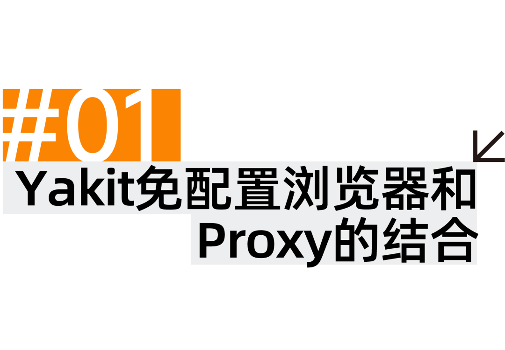
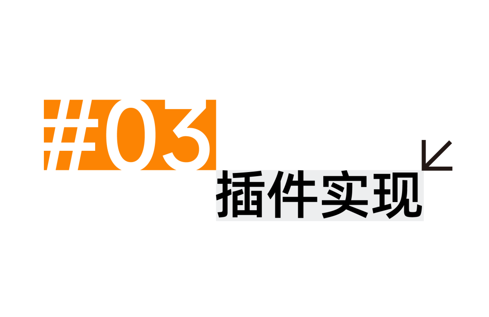

<<<<<<< HEAD
#  Yak中的Proxy浏览器插件


=======
#  Oi，不要小看Proxy浏览器插件与Yak之间的羁绊啊！   
原创 Yak  Yak Project   2025-02-20 17:30  
  
  
  
超级牛：  
  
不知道啊  
# 这插件他喊着友情啊羁绊啊未来啊什么的就冲上来了  
  
  
>>>>>>> f4538a210d3a0684bb752d3a4648d7bd062fbac4
  
  
  
  
  
<<<<<<< HEAD
  
对于 Yakit 用户来说，免配置浏览器带来了很多的便捷，一键启动即可打开一个配置好了 Yakit MITM 代理的浏览器，并且与日常使用的浏览器互不干扰。  
为了进一步增强免配置浏览器的使用体验、以及完成对 Proxy SwitchyOmega 插件需求的过渡，我们开发了一个类似 Proxy SwitchyOmega 功能的插件，现在当用户打开免配置浏览器时，本质上是通过插件控制浏览器的代理项，而非此前的使用固定的 chromeFlags  的方式来启动，现在点击启动免配置浏览器时，会通过 --load-extension chromeFlags  来加载我们编写的浏览器插件，如下图：  
=======
  
## 对于 Yakit 用户来说，免配置浏览器带来了很多的便捷，一键启动即可打开一个配置好了 Yakit MITM 代理的浏览器，并且与日常使用的浏览器互不干扰。  
## 为了进一步增强免配置浏览器的使用体验、以及完成对 Proxy SwitchyOmega 插件需求的过渡，我们开发了一个类似 Proxy SwitchyOmega 功能的插件，现在当用户打开免配置浏览器时，本质上是通过插件控制浏览器的代理项，而非此前的使用固定的 chromeFlags  的方式来启动，现在点击启动免配置浏览器时，会通过 --load-extension chromeFlags  来加载我们编写的浏览器插件，如下图：  
>>>>>>> f4538a210d3a0684bb752d3a4648d7bd062fbac4
  
  
  
插件通过对当前的导航地址**http://mitm/**注入一个 content.js 来提示用户插件当前正在工作，用户也可以手动将插件   
**Pin** 在chrome 的工具栏中，方便后续的使用。  
> 当前悬浮框UI，只会在导航地址显示，当访问别的网站时，可以点击插件图标进行使用  
  
  
当前浏览器插件的默认代理项是点击 "启动免配置 Chrome" 是配置的代理，也就是如下图中的 **http://127.0.0.1:9999**  
  
  
  
  
  
在加载了浏览器插件后，免配置浏览器完全可以类似正常的浏览器使用，当切换到   **[Yakit MITM]** 代理项时，访问的流量会经过 Yakit MITM：  
  
  
  
当用户选择 **[系统代理]** 时，会和正常浏览器访问网站一样，流量不会经过 Yakit MITM：  
  
  
  
Yakit 浏览器插件也提供了自定义添加，相对比较简单。  
  
  
  
<<<<<<< HEAD
  
=======
  
##   
>>>>>>> f4538a210d3a0684bb752d3a4648d7bd062fbac4
  
代理实现部分用到了 Chrome Extensions 提供的 chrome.proxy api，  
基本概念如下：  
  
<<<<<<< HEAD
  
 
在 proxy.ProxyConfig 对象中定义。根据 Chrome 的代理设置， 这些设置可能包含 proxy.ProxyRules 或 proxy.PacScript。  
  
  
=======
  
###   
  
在 proxy.ProxyConfig 对象中定义。根据 Chrome 的代理设置， 这些设置可能包含 proxy.ProxyRules 或 proxy.PacScript。  
  
  
###   
>>>>>>> f4538a210d3a0684bb752d3a4648d7bd062fbac4
  
ProxyConfig 对象的 mode 属性决定了 Chrome 的整体行为 代理用量。它可以采用以下值：  
  
**direct**  
在**direct**模式下，所有连接都是直接创建，不涉及任何代理。此模式允许**ProxyConfig** 对象中没有其他参数。  
  
**auto_detect**  
在**auto_detect**模式下，代理配置由可下载的 PAC 脚本决定。  
  
**pac_script**  
在**pac_script** 模式下，代理配置由从系统检索到的 PAC 脚本决定 取自**proxy.PacScript** 对象中指定的网址，或直接从 **data** 元素中获取   
**proxy.PacScript** 对象中指定的任何 ID。除此之外，此模式不允许使用任何其他参数，在 **ProxyConfig**对象中。  
  
**fixed_servers**  
在**fixed_servers** 模式下，代理配置编码在**proxy.ProxyRules** 对象中。其 代理规则中介绍了具体结构。除此之外，**fixed_servers** 模式**ProxyConfig** 对象中的参数  
  
**system**  
在**system** 模式下，代理配置从操作系统中获取。此模式不允许在**ProxyConfig**对象中包含更多参数。请注意，**system** 模式不同于 设置无代理配置。对于后一种情况，只有在以下情况下，Chrome 才会回退到系统设置：任何命令行选项都不会影响代理配置。  
  
  
###   
```
db/ - IndexedDB 数据库操作
public/
  - background.js - 扩展后台脚本
  - content.js - 内容脚本
  - proxy/ - 代理相关功能
  manifest.json - 配置清单
src/
  - components/ - React 组件
  - pages/ - 页面组件
  - types/ - TypeScript 类型定义
  - network/ - 网络通信相关
```  
  
首先需要在   
**manifest.json** 中声明 proxy 权限  
```
{
  "manifest_version": 3,
  "name": "Yakit Chrome Endpoint",
  "permissions": [
    "proxy"
  ],
  ...
}
```  
  
核心部分的代理设置有 **fixed_servers** 和 **pac_script** 两种， 使用方式如下：  
  
**fixed_servers**  
```
const proxyConfig = {
    mode: "fixed_servers",
    rules: {
        singleProxy: {
            scheme: 'http',
            host: "127.0.0.1",
            port: 9999
        },
        bypassList: ["localhost", "127.0.0.1"]
    }
};

await new Promise((resolve) => {
    chrome.proxy.settings.set({
        value: proxyConfig,
        scope: 'regular'
    }, resolve);
});
```  
  
**pac_script**  
```
var config = {
  mode: "pac_script",
  pacScript: {
    data: "function FindProxyForURL(url, host) {\n" +
          "  if (host == 'www.yaklang.com')\n" +
          "    return 'PROXY 127.0.0.1:2080';\n" + // 设置的另外一个 fixed_servers 代理
          "  return 'DIRECT';\n" +
          "}"
  }
};

await new Promise((resolve) => {
    chrome.proxy.settings.set({
        value: config ,
        scope: 'regular'
    }, resolve);
});
```  
  
剩下的一些 UI 部分则是交给 AI 完成 。  
  
  
  
  
目前浏览器插件的 UI 以及用户交互部分还很僵硬，亟须改进。也理解了 Proxy SwitchyOmega 为何用户众多 —— 它的代理切换功能确实很好用，值得参考借鉴。  
  
  
**END**     
**参考链接 ：**   
https://developer.chrome.com/docs/extensions/reference/api/proxy#type-ProxyConfig  
  
  
 **YAK官方资源**  
  
  
Yak 语言官方教程：  
https://yaklang.com/docs/intro/Yakit   
视频教程：  
https://space.bilibili.com/437503777  
Github下载地址：  
https://github.com/yaklang/yakit  
Yakit官网下载地址：  
https://yaklang.com/  
Yakit安装文档：  
https://yaklang.com/products/download_and_install  
Yakit使用文档：  
https://yaklang.com/products/intro/  
常见问题速查：  
https://yaklang.com/products/FAQ  
  
  
  
  
  
  
