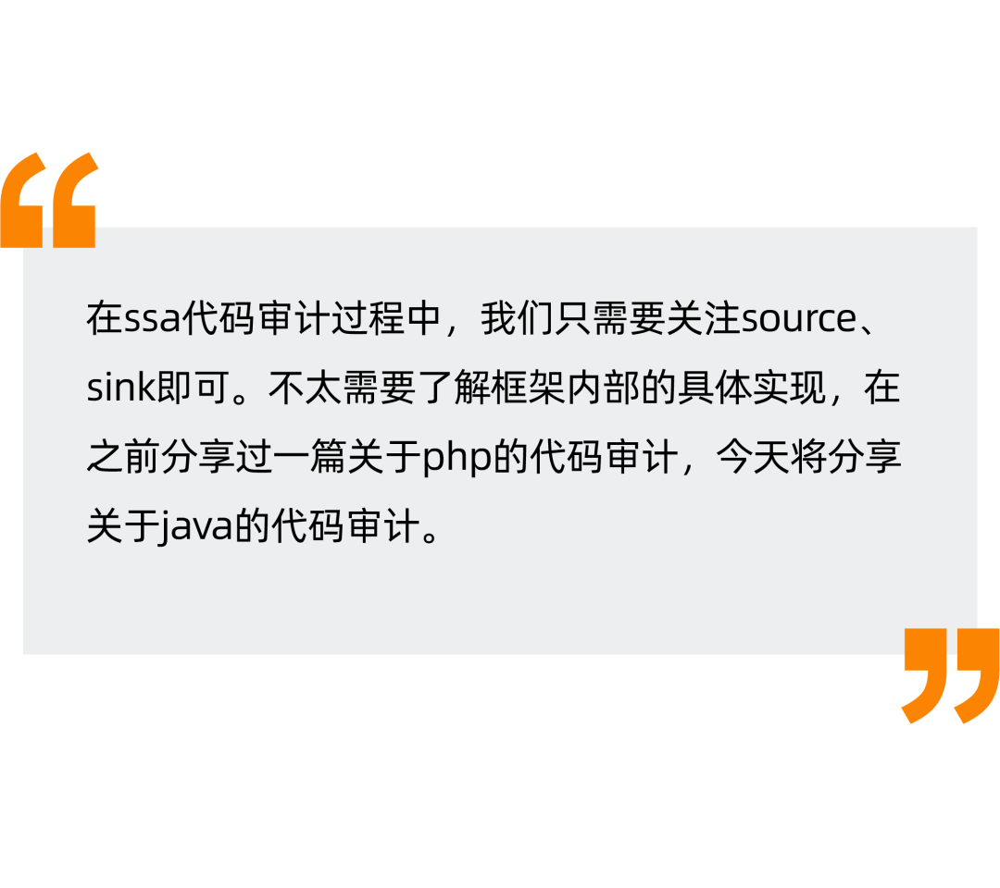
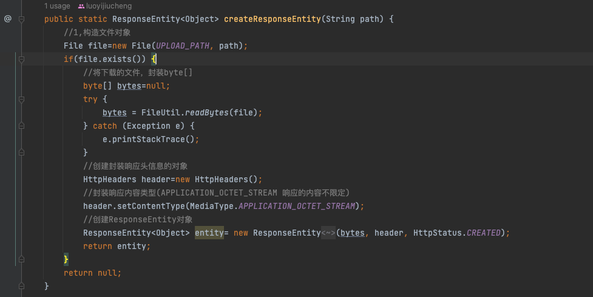
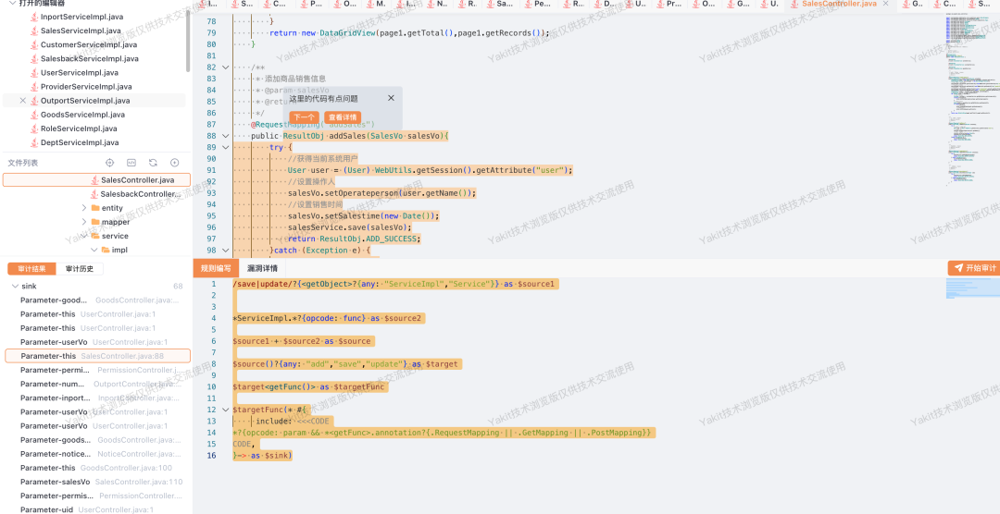
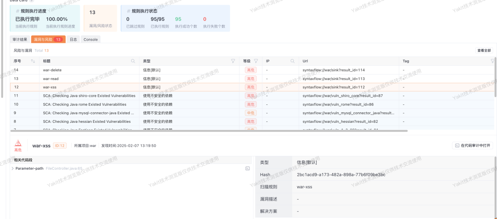

#  Java代码审计   
    
  
  
  
- 在java中，不一定是和php一样 （只要有文件上传就一定有漏洞（bushi）），比如springBoot中，条件限制非常多。  
  
- 硬编码：在代码审计过程中，我们需要关注硬编码，有时会有意想不到的收获  
  
- SCA：在java SCA中，某些依赖的版本可能会出现很多问题。(shiro)  
  
  
  
针对Shiro来说，Apache官方说是集成了鉴权和访问控制。Shiro的本质就是一个filter过滤器。filter过滤器需要关注两个点。  
> 如何进行路径匹配？  
> 如何进行权限鉴定和访问控制？  
> 针对filter来说，我们重点关注两个方法。init和dofilter  
  
### init方法  
  
  
> 这里进行了一个过滤器的配置。其实就是相当于从ini文件中获取到过滤的内容。  
  
### doFilter方法：  
  
  
### shiro过滤流程  
```
```  
  
  
  
在这里可以看到不同的requestUri获取到的filterChain不同，而在getRequestUri中在normalize函数中处理的有问题，就造成了权限绕过。  
  
  
  
可以从github中获取该系统源码，然后进行编译。  
  
  
### shiro权限绕过  
  
经过代码扫描后，发现shiro的版本是1.4.0，处于权限绕过的版本中，进行尝试利用。  
  
  
  
这里先查看properties中shiro配置是如何进行定义。  
  
  
  
**正常请求 & 权限绕过**  
  
  
  
  
### 任意文件删除  
  
写出这样的一条syntaxFlow规则，含义如下：  
  
（1）找到所有的delete并且条件为：object的全限定名是**java.io.file**作为一个source  
  
（2）在syntaxflow向上寻找的路径中，opcode是param，并且function的注解中有 **RequestMapping||GetMapping||PostMapping**  
```
delete?{*<getObject><fullTypeName>?{have: "java.io.File"}} as $source

$source<getObject> as $File
$File #{include: <<<CODE
*?{opcode: param && *<getFunc>.annotation?{.RequestMapping || .GetMapping || .PostMapping}}
CODE}-> as $sink

/*
File file = new File(xxx)
File.delete()
*/
```   
  
在文件删除的过程中，向上寻找的路径中包含param，并且func中含有  
**RequestMapping、getMapping、postMapping**  
  
  
  
找到三个调用点，这里找到调用点之后，直接将传入的内容，进行拼接，然后进行了文件删除。  
  
  
  
  
  
  
### 任意文件读取  
```
readBytes?{<getObject><fullTypeName>?{have: "cn.hutool.core.io"}} as $source

$source(* #{
    include: <<<CODE
*?{opcode: param && *<getFunc>.annotation?{.RequestMapping || .GetMapping || .PostMapping}}
CODE
}-> as $sink)
```  
  
  
  
### 多处Xss：  
  
这里写一条syntaxflow规则，大致含义如下：  
  
（1）找到serviceImpl中所有的func，这些func名称中含有add、save、update  
  
（2）找到所有save、update 的object名称中含有ServiceImpl/Service  
  
（3）找到这些函数调用点，并且函数参数向上找的过程中，annotation中含有requestmapping.....  
```
/save|update/?{<getObject>?{any: "ServiceImpl","Service"}} as $source1

*ServiceImpl.*?{opcode: func} as $source2

$source1 + $source2 as $source

$source()?{any: "add","save","update"} as $target

$target<getFunc()> as $targetFunc

$targetFunc(* #{
     include: <<<CODE
*?{opcode: param && *<getFunc>.annotation?{.RequestMapping || .GetMapping || .PostMapping}}
CODE,
}-> as $sink)
```   
  
#### Tip：  
  
这里看了几处，如果是权限绕过的话，session中不存在用户，那么基本上不能使用添加的功能。  
  
  
  
找到一处添加商品功能，可以发送payload对此处进行利用。  
  
  
  
  
  
  
### 其他思路：  
- 在扫描过程中，其实还找到多处的文件上传的利用，但奈何是利用date作为路径名称，虽然有修改文件名的功能，但是限制太大。  
  
- 此项目为热部署，并且使用的是thymeleaf作为模板，如果能控制到html/jar，可以通过thymeleaf来执行命令RCE。  
  
### 演示视频：  
  
我们都将其作为一个规则组  
  
  
  
 **YAK官方资源**  
  
  
Yak 语言官方教程：  
https://yaklang.com/docs/intro/Yakit   
视频教程：  
https://space.bilibili.com/437503777  
Github下载地址：  
https://github.com/yaklang/yakit  
Yakit官网下载地址：  
https://yaklang.com/  
Yakit安装文档：  
https://yaklang.com/products/download_and_install  
Yakit使用文档：  
https://yaklang.com/products/intro/  
常见问题速查：  
https://yaklang.com/products/FAQ 
  
  
