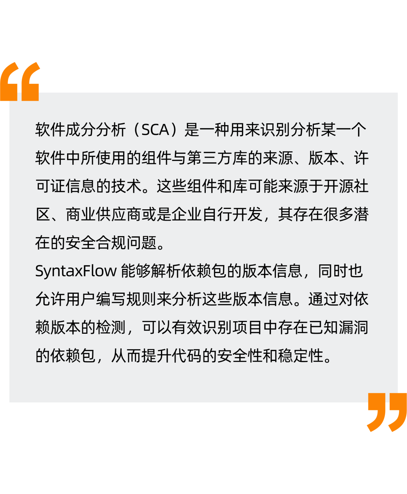
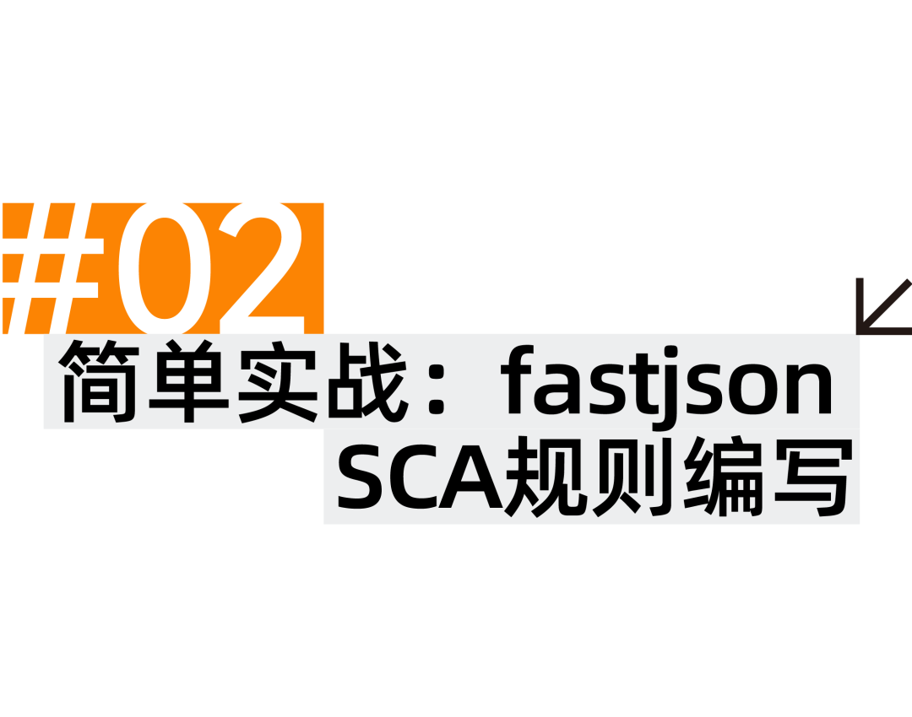
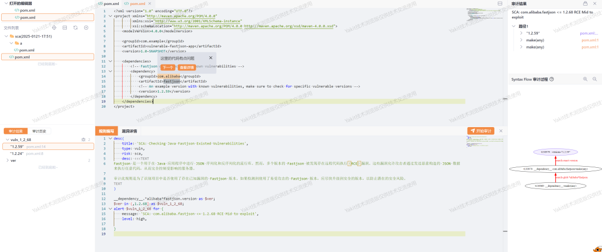
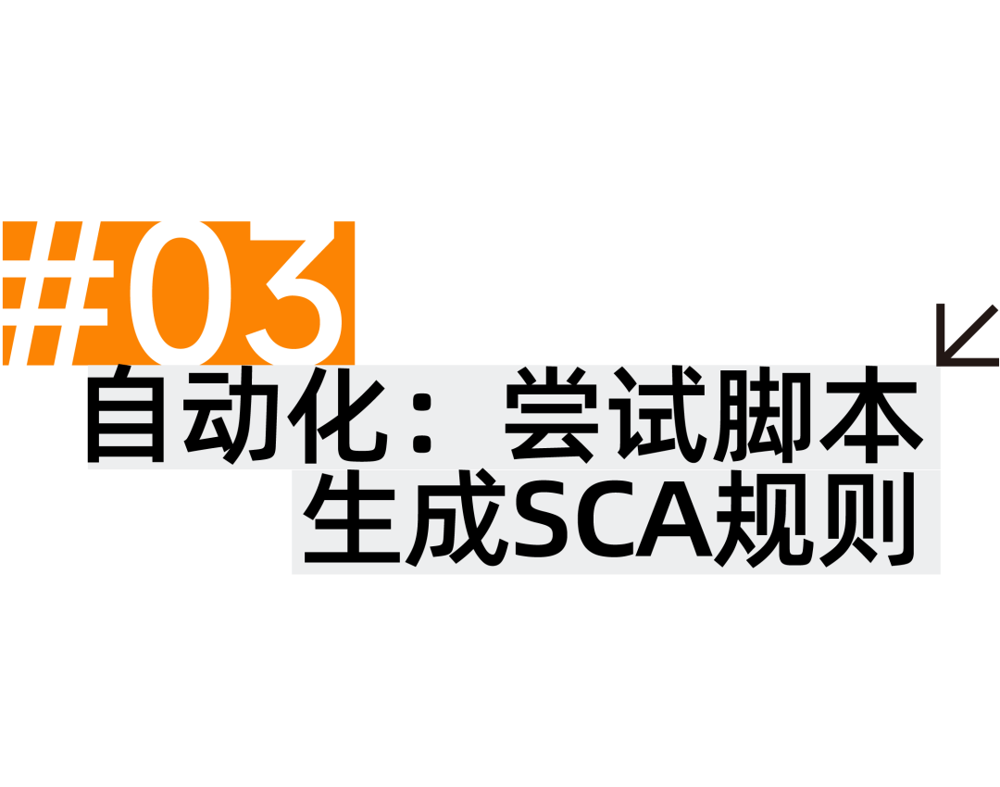
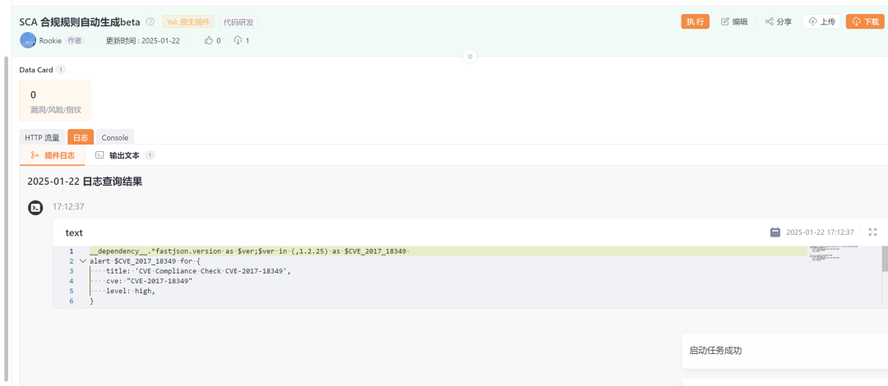
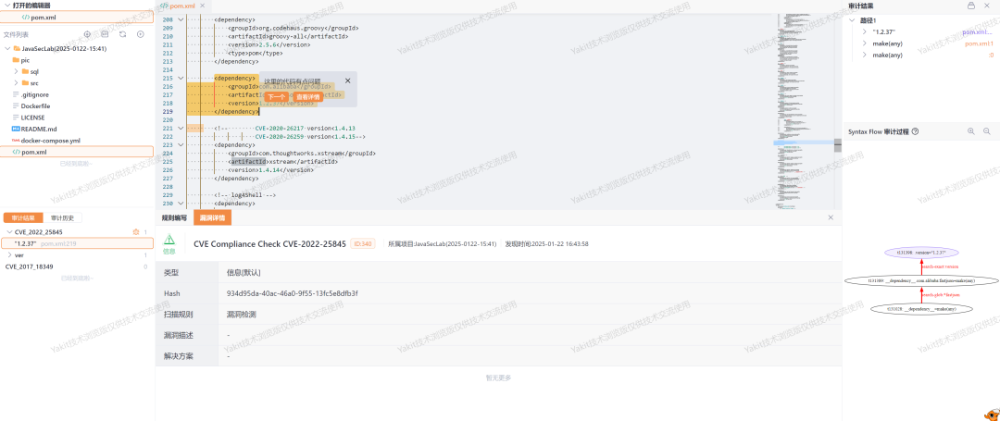
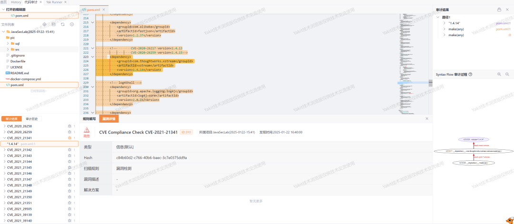

#  很好SCA规则，爱来自Syntaxflow   
  
  
  
  
  
  
  
SyntaxFlow 通过内置变量 __dependency__ 存储解析后的依赖信息。用户可以通过筛选依赖名称的方式获取特定依赖的版本信息或文件信息。以下是获取依赖信息的示例：  
```
// 获取依赖名以 fastjson 结尾的依赖版本
__dependency__.*fastjson.version as $ver;

// 获取依赖名以 fastjson 结尾所在的依赖文件
__dependency__.*fastjson.filename as $file;
```  

- **__dependency__.*fastjson.version as $ver;**  
：筛选依赖名称以 fastjson 结尾的  
**依赖版本**，并将结果存储在变量   
**$ver**中。  
  
- **__dependency__.*fastjson.filename as $file;**  
：筛选依赖名称以 fastjson 结尾的  
**依赖文件**，并将结果存储在变量   
**$file** 中。  
  
  
  
获取到依赖的版本信息后，下一步通常是筛选出存在已知漏洞的版本。SyntaxFlow 提供了 version_in 语法来定义版本区间，以便检测依赖版本是否落在特定的漏洞版本范围内。  
### version_in 语法示例  
  
直接来看一个语法示例  
```
// 检查版本是否在 1 < version <= 2 范围内
$version in (1,2]

// 检查版本是否在 1.0.0 < version <= 2.0.0 范围内
$version in (1.0.0,2.0.0]

// 检查版本是否在 1.2.3-beta < version <= 2.2.1-beta 范围内
$version in (1.2.3-beta,2.2.1-beta]

// 检查版本是否在 [1.1,1.3] 或 [2.2,2.3] 或 [3.2,3.3] 范围内
$version in [1.1,1.3] || [2.2,2.3] || [3.2,3.3]
```   
  
此外，也可以使用分析值筛选过滤的语法进行版本筛选：  
```
$version ?{version_in:(1,2]} // 版本号是否在 1 < version <= 2 范围内
$version ?{version_in:(1.0.0,2.0.0]} // 版本号是否在 1.0.0 < version <= 2.0.0 范围内
$version ?{version_in:(1.2.3-beta,2.2.1-beta]} // 版本号是否在 1.2.3-beta < version <= 2.2.1-beta 范围内
$version ?{version_in:[1.1,1.3] || [2.2,2.3] || [3.2,3.3]} // 版本号是否在多个范围内
```  
> 总结一下：version_in 语法  
> 使用 in 关键字版本范围表示："]" 闭 ")"开版本范围之间可以通过 "||" 并集多个不连续的版本范围。   
  
  
  
下面是yak内置的fastjson SCA规则的一部分  
```
__dependency__.*alibaba*fastjson.version as $ver;
$ver in (,1.2.68] as $vuln_1_2_68;
alert $vuln_1_2_68 for {
    message: 'SCA: com.alibaba.fastjson <= 1.2.68 RCE Mid to exploit',
    level: high,

}
```  
简单解析一下其中使用，首先通过   
**__dependency__** 内置变量获取到审计项目的所有依赖信息，然后使用  
***alibaba*fastjson**作为过滤条件获取到所有和fastjson相关的依赖信息。最后通过  
**version**获取到依赖的版本信息，之后就可以通过检查依赖的版本来进行风险提示。  
  
下面是一个简单案例的使用  
  
  
  
整个流程十分简单明了，不过SCA规则数量会相对更多，如果都是手写规则，可能比较吃力。而本身SCA规则的格式相对稳定，所以这部分的规则可以尝试通过脚本生成。  
  
  
  
比较常见的一个SCA合规信息的获取来源是CVE信息库，yakit本身有CVE信息基础支持，所以可以尝试联动，进行CVE合规的自动生成。cve.QueryEx的返回值结构的部分内容如下所示  
```
type CVE struct {
    CVE               string 
    CWE               string
    ProblemType       []byte
    References        []byte
    TitleZh           string
    Solution          string
    DescriptionMain   string
    DescriptionMainZh string
    Descriptions      []byte
    Vendor            string
    Product           string

    CPEConfigurations []byte
    ...
}
```  

  
其中在生成合规规则需要重点关注的信息有两个：  
- CVE ：CVE编号  
  
- CPEConfigurations：CPE配置（这部分存储涉及产品及其版本的相关信息）  
  
还是以fastjson为例。先使用CVE的基础支持查询出对应的CVE信息。  
```
for i in cve.QueryEx(cve.product("fastjson")){ // 搜索产品为 fastjson 的CVE
    println(i.CVE)
    println(string(i.CPEConfigurations))
}

/*
CVE-2017-18349
{
    "CVE_data_version": "4.0",
    "nodes": [
        {
            "operator": "OR",
            "cpe_match": [
                {
                    "vulnerable": true,
                    "cpe23Uri": "cpe:2.3:a:pippo:pippo:1.11.0:*:*:*:*:*:*:*",
                    "versionStartExcluding": "",
                    "versionEndExcluding": "",
                    "versionStartIncluding": "",
                    "versionEndIncluding": ""
                },
                {
                    "vulnerable": true,
                    "cpe23Uri": "cpe:2.3:a:alibaba:fastjson:*:*:*:*:*:*:*:*",
                    "versionStartExcluding": "",
                    "versionEndExcluding": "1.2.25",
                    "versionStartIncluding": "",
                    "versionEndIncluding": ""
                }
            ],
            "children": []
        }
    ]
}


CVE-2022-25845
{
    "CVE_data_version": "4.0",
    "nodes": [
        {
            "operator": "OR",
            "cpe_match": [
                {
                    "vulnerable": true,
                    "cpe23Uri": "cpe:2.3:a:alibaba:fastjson:*:*:*:*:*:*:*:*",
                    "versionStartExcluding": "",
                    "versionEndExcluding": "1.2.83",
                    "versionStartIncluding": "",
                    "versionEndIncluding": ""
                }
            ],
            "children": []
        },
        {
            "operator": "OR",
            "cpe_match": [
                {
                    "vulnerable": true,
                    "cpe23Uri": "cpe:2.3:a:oracle:communications_cloud_native_core_unified_data_repository:22.2.0:*:*:*:*:*:*:*",
                    "versionStartExcluding": "",
                    "versionEndExcluding": "",
                    "versionStartIncluding": "",
                    "versionEndIncluding": ""
                }
            ],
            "children": []
        }
    ]
}
*/
```  
  
可以看到在  
**CPEConfigurations**字段中有若干条配置，每个配置内部有  
**cpe_match**用来描述相关的产品以及其受影响的版本。各个字段的意义有明确指示。  
  
这里直接提供一个脚本生成的demo  
```
product =  cli.String("product",cli.setRequired(true),cli.setVerboseName("产品名"))
cli.check()

matchToVersionRange = func(match, wantproduct) {
    /*
    如果cpe_match的CPEuri有指定的版本，那么则代表其对应的版本是一个特定的指定版本。
    若未指定版本则依据其他的versionStartExcluding等数据划定一个版本范围。
    */
    cpeArray = str.Split(match["cpe23Uri"], ":")
    if len(cpeArray) < 6 {
        return
    }

    if cpeArray[4] != wantproduct {
        return
    }

    version = cpeArray[5]
    if version != "*"{
        return f"[${version},${version}]"
    }

    versionStart = ""
    startBoundary = "("
    versionEnd = ""
    endBounday = ")"
    if match["versionStartExcluding"] != "" {
        versionStart = match["versionStartExcluding"]
    }else if match["versionStartIncluding"] != "" {
        versionStart = match["versionStartIncluding"]
        startBoundary = '['
    }

    if match["versionEndExcluding"] != "" {
        versionEnd = match["versionEndExcluding"]
    }else if match["versionEndIncluding"] != "" {
        versionEnd = match["versionEndIncluding"]
        endBounday = "]"
    }
        
    return f"${startBoundary}${versionStart},${versionEnd}${endBounday}"

}

cveInfoToAlert = func (cveInfo) {
    serverity = str.ToLower(cveInfo.Severity)
    return f`{
    title: 'CVE Compliance Check ${cveInfo.CVE}',
    cve: "${cveInfo.CVE}"
    level: ${serverity},
}
`
}

rule = f"__dependency__.*${product}.version as \$ver;"

for i in cve.QueryEx(cve.product(product)){

    alertMessage = cveInfoToAlert(i)
    versionRangeList = []
    
    cpeMap =json.loads(i.CPEConfigurations)
    for node in cpeMap["nodes"] {
        for match in node["cpe_match"] {
            versionRange = matchToVersionRange(match, product)
            if versionRange != "" {
                versionRangeList = append(versionRangeList, versionRange)
            }
        }
    }

    if len(versionRangeList) < 1  {
        continue
    }
    versionCollect = str.Join(versionRangeList, " || ")

    alertVerName := "$"+str.Replace(i.CVE, "-", "_", -1)
    rule +=f`\$ver in ${versionCollect} as ${alertVerName} 
alert ${alertVerName} for ${alertMessage}
`
}

yakit.Text(rule)
```  
  
生成一个fastjson的CVE合规规则  
  
  
```
__dependency__.*fastjson.version as $ver;
$ver in (,1.2.25) as $CVE_2017_18349 
alert $CVE_2017_18349 for {
    title: 'CVE Compliance Check CVE-2017-18349',
    cve: "CVE-2017-18349"
    level: high,
}

$ver in (,1.2.83) as $CVE_2022_25845 
alert $CVE_2022_25845 for {
    title: 'CVE Compliance Check CVE-2022-25845',
    cve: "CVE-2022-25845"
    level: medium,
}
```    
我们这里使用一个lab的源码作为审计目标：  
JavaSecLab（https://github.com/whgojp/JavaSecLab）  
  
其中有一些有问题的依赖库，先来使用生成的fastjson的规则测试。  
  
来到代码审计页面编译好项目，运行上述脚本获取到的规则。可以看到检查出了 CVE-2022-25845 ，此CVE命中条件版本低于 1.2.83，而Lab的版本为 1.2.37，符合预期。  
  
  
  
当然我们可以修改一下目标产品生成一些其他的合规规则比如 xstream，此靶场依赖里的xstream版本为 1.4.14，此版本有多个CVE。  
  
修改上面提供的生成脚本的目标产品，再次生成审计规则。  
```
__dependency__.*xstream.version as $ver;$ver in (,1.4.6] || [1.4.10,1.4.10] as $CVE_2013_7285 
alert $CVE_2013_7285 for {
    title: 'CVE Compliance Check CVE-2013-7285',
    cve: "CVE-2013-7285"
    level: high,
}

....

$ver in (,1.4.19] as $CVE_2022_40152 
alert $CVE_2022_40152 for {
    title: 'CVE Compliance Check CVE-2022-40152',
    cve: "CVE-2022-40152"
    level: high,
}

...
```  
  
再在代码审计中使用生成的规则，可以看到产出了多个CVE检查的提示  
  
  
  
上述的demo脚本还有许多可以优化的地方，比如对供应商的筛选，以及一些产品的别名的修正等，感兴趣的师傅可以继续尝试可改进。  
  
  
 **YAK官方资源**  
Yak 语言官方教程：  
https://yaklang.com/docs/intro/Yakit   
视频教程：  
https://space.bilibili.com/437503777  
Github下载地址：  
https://github.com/yaklang/yakit  
Yakit官网下载地址：  
https://yaklang.com/  
Yakit安装文档：  
https://yaklang.com/products/download_and_install  
Yakit使用文档：  
https://yaklang.com/products/intro/  
常见问题速查：  
https://yaklang.com/products/FAQ 
  
  
  
  
  
  
