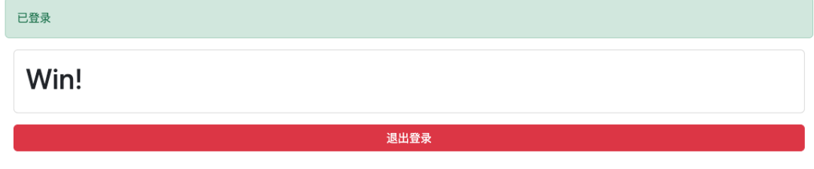

#  震惊！YAK-JWT靶场的通关方式竟然是...   
Yak  Yak Project   2025-02-14 17:30  
  
  
  
先祝大家情人节快乐  
  
然而作为一头单身奋斗牛，超级牛表示：  
  
心中无爱人，工作自然神  
  
  
  
  
  
  
  
  
  
打开jwt靶场是一个登录页面  
  
  
  
尝试弱口令admin/admin成功登录。  
  
  
  
通过抓包可以看到，整个登录过程主要是3个请求：  
  
第一个页面：  
**https://127.0.0.1:8080/jwt/unsafe-login1**（GET请求）  
  
这个页面是登录首页，通过localStorage从会话中读取VULINBOX_JWT变量，如果存在则通过这个jwt请求/jwt/unsafe-login1/profile，获取用户信息并展示。否则显示登  
录页面。  
  
  
  
第二个页面：  
**https://127.0.0.1:8080/jwt/unsafe-login1**（POST请求）  
  
同在/jwt/unsafe-login1页面，通过POST请求发送认证信息，如果成功则返回jwt，否则返回认证失败的错误  
  
  
  
  
  
第三个页面：  
**https://127.0.0.1:8080/jwt/unsafe-login1/profile**  
  
通过Authorization将jwt传递给后端，如果验证成功则返回用户信息，否则返回认证失败的提示  
  
  
  
  
  
  
  
用户首先通过用户名密码向后端请求得到jwt，再通过jwt向后端请求得到完整用户信息，并将信息展示在前端。  
  
  
  
  
  
首先打开JWT的登录(未验证算法)案例，在这个案例中，后端未校验加密算法，将根据用户传递的加密算法解密验证jwt。  
  
如图是正常的jwt结构。可以看到在header中存储了用户名，根据页面提示，游戏目标是**为用户信息添加flag字段**。所以我们的目标就是修改jwt内的header，并绕过后端的校验。  
  
  
  
首先了解一下jwt结构：jwt由3部分组成，使用.连接，第一部分是header信息，第二部分是Claims信息，第三部分是签名。  
  
如果使用node方式生成jwt那header部分和Claims部分都是直接通过base64编码，签名为空，那可以编写脚本：  
```
header = codec.EncodeBase64(json.dumps({
        "age": 25,
        "alg": "none",
        "kid": 1,
        "typ": "JWT",
        "username": "admin",
        "flag":1,
    }))
claims = codec.EncodeBase64(json.dumps({

    }))

println("%s.%s."%[header,claims])

```  
  
通过webfuzzer将刚生成的jwt发送到/jwt/unsafe-login1/profile接口，发现这次返回值只有一个flag  
  
  
  
通过mitm抓包改包修改jwt可以看到通关页面  
  
  
  
  
  
打开案例：登录(错误中泄漏key)  
  
和案例1相同的页面，发现获取用户信息的接口改为了 **/jwt/unsafe-login2/profile**。尝试使用案例1的手段发现报错：  
  
  
  
可以看到原因是禁用了none的认证方式：'none' signature type is not allowed，但从错误中可以看到泄漏的key。  
  
key是一个byte数组，所以可以编写yak代码，通过泄漏的key生成修改后的jwt：  
```
key = []byte{100,89,84,117,75,83,66,116,72,120,88,98,73,109,110,70,99,74,97,75}
jwtStr = jwt.JWTGenerateEx("HS256", {
        "flag":1,
    },{}, key)~
println(jwtStr)
```    
将生成的jwt应用到/jwt/unsafe-login2/profile接口，得到返回数据  
  
  
  
从前端页面可以看到修改成功  
  
  
  
  
**END**  
  
  
 **YAK官方资源**  
  
  
Yak语言官方教程：  
https://yaklang.com/docs/intro/
Yakit视频教程：  
https://space.bilibili.com/437503777  
Github下载地址：  
https://github.com/yaklang/yakit  
Yakit官网下载地址：  
https://yaklang.com/  
Yakit安装文档：  
https://yaklang.com/products/download_and_install  
Yakit使用文档：  
https://yaklang.com/products/intro/  
常见问题速查：  
https://yaklang.com/products/FAQ 
  
  
  
  
  
  
