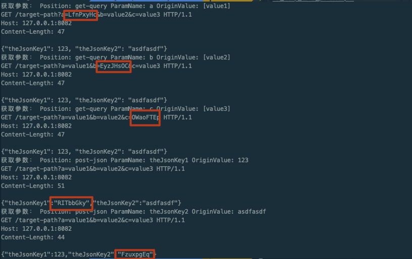

# [fuzz] 模糊测试工具库

可能是北半球最好用的模糊测试工具包。

很多时候，本扩展包的内容不仅仅可以用于生成模糊测试的 Payload，也可以用于生成批量渲染的 HTTP 请求。

import TOCInline from '@theme/TOCInline';

<TOCInline toc={toc} />

## 为什么会有这个包？fuzz 应该用在哪里？

本身模糊测试并不是一个高深的话题，其实使用场景也非常非常多：

在日常的使用中，我们经常会使用 Burpsuite 的 Intruder 添加自定义字典，批量发送 HTTP 数据包，然后根据测试的结果进行输出点判断。往往这些步骤都是手动进行的，我们的 yak fuzz 模块希望为这种方式提供可编程的实现，帮助大家更容易编写漏洞检测算法，把渗透测试经验，沉淀为可规模化的产品/算法功能。

另一个场景，我们在进行爆破的时候，需要生成字典，例如

```txt title='字典样例'
admin1
admin2
admin3
...
admin10
1
2
3
...
10
```

有时候，我们需要扫描某些目标，但是某些情况下，需要调用的文件支持`主机:端口`的形态，我们需要生成目标文件作为别的工具的输入。

等等...

这是一个充满想象力的模块，怎么样使用需要用户极大的发挥自己的想象力。

## 模糊测试字符串

模糊测试字符串的核心函数是

`fn fuzz.Strings(origin: string) []string`

这个函数会把核心的 `{{  }}` 标签转变为需要渲染的内容，例如 `{{int(1-5)}}` 会被渲染为 `[1 2 3 4 5]`

我们的标签是 fuzz 库执行的关键。他其实更像是 `正则` 的逆向，我们规定模糊测试渲染函数和渲染条件，通过执行 `fuzz.Strings` 来获取渲染的结果，以次把一个字符串，变成 N 个字符串。

### QuickStart: 尝试解析一个数字列表

```go
origin := "{{int(1,3,4,80-88)}}"
res := fuzz.Strings(origin)
println("需要模糊渲染的字符串为：", origin)
println("渲染结果为：")
dump(res)

/*
OUTPUT:

需要模糊渲染的字符串为： {{int(1,3,4,80-88)}}
渲染结果为：
([]string) (len=12 cap=12) {
 (string) (len=1) "1",
 (string) (len=1) "3",
 (string) (len=1) "4",
 (string) (len=2) "80",
 (string) (len=2) "81",
 (string) (len=2) "82",
 (string) (len=2) "83",
 (string) (len=2) "84",
 (string) (len=2) "85",
 (string) (len=2) "86",
 (string) (len=2) "87",
 (string) (len=2) "88"
}
*/
```

### fuzz 标签定义以及使用

我们如果想要使用 fuzz 标签，需要明确两个概念，标签的格式是自定义的，目前支持 `{{` 和 `}}` 作为标签的标记，也支持 `__` 和 `__`。

我们以 `{{int()}}` 为例，`int` 代表标签要渲染的具体功能，`()` 括号中的内容是渲染材料，有一些标签需要，有一些标签可以没有，例如 `随机类` 的标签。

在同一个渲染的字符串中，完全相同的标签不会做排列组合，而是被渲染成相同的元素。如果真的需要标签渲染内容完全相同，并且需要分别渲染，可以在标签函数功能后增加一个数字，例如 `{{int1()}}`, `{{int2()}}` 这两个标签同 `{{int()}}` 完全等效，但是可以分别渲染。

#### 标签分级别

一般来说，标签分为两类，优先级不同，编码标签的优先级是最低的。

何为编码标签？

`yak -c 'dump(fuzz.Strings("{{base64enc(aaaaiasdfjklasijldf)}}"))'`

当我们执行上面的代码的时候，我们使用了一个新标签 `base64enc`，这个标签，可以把括号内的内容编码成 `base64`

```go
([]string) (len=1 cap=1) {
 (string) (len=28) "YWFhYWlhc2RmamtsYXNpamxkZg=="
}
```

直接使用 `base64enc` 标签，会编码目标字符串，如果配合其他标签使用，同样也会编码成多个不同的字符串，我们看如下的例子

`yak -c 'dump(fuzz.Strings("{{base64enc(aa-{{int(1-10)}})}}"))'`

执行结果为 

```go
([]string) (len=10 cap=10) {
 (string) (len=8) "YWEtMQ==",
 (string) (len=8) "YWEtMg==",
 (string) (len=8) "YWEtMw==",
 (string) (len=8) "YWEtNA==",
 (string) (len=8) "YWEtNQ==",
 (string) (len=8) "YWEtNg==",
 (string) (len=8) "YWEtNw==",
 (string) (len=8) "YWEtOA==",
 (string) (len=8) "YWEtOQ==",
 (string) (len=8) "YWEtMTA="
}
```

上述结果其实是列表 `[aa-1 aa-2 ... aa-7 aa-8 aa-9 aa-10]` 编码 base64 之后的结果。

### 【基础标签】`{{int}}` 渲染整数/端口

这是我们目前接触过的第一个标签，可以把 `1-10,44,80-800` 这种数字范围的端口转变成分别的数字。

1. 例如 `1-10` 变成 `[1 2 3 4 5 6 ... 9 10]`
2. `1-4,7-9` 变成 `[1 2 3 4 7 8 9]`

#### 用途

最常用的用户其实是渲染一个端口，端口组；

当然，如果我们想要爆破密码的时候，生成密码也可以使用这个标签。

#### 别名

我们以 `{{int(1-10)}}` 为例，如下的写法均等效，**不区分大小写**

1. 增加一个数字后缀 `{{int1(1-10)}}`
2. `{{i(1-10)}}` | `{{i1(1-10)}}` | `{{i2(1-10)}}`
3. `{{port(1-10)}}` | ``{{port2(1-10)}}` `
3. `{{integer(1-10)}}` | ``{{integer2(1-10)}}` `

#### 用法用例，疑难杂症

##### 案例一：最简单的用法

我们接触过这个例子，其实非常容易理解

```go
origin := "{{int(1,3,4,80-88)}}"
res := fuzz.Strings(origin)
println("需要模糊渲染的字符串为：", origin)
println("渲染结果为：")
dump(res)

/*
OUTPUT:

需要模糊渲染的字符串为： {{int(1,3,4,80-88)}}
渲染结果为：
([]string) (len=12 cap=12) {
 (string) (len=1) "1",
 (string) (len=1) "3",
 (string) (len=1) "4",
 (string) (len=2) "80",
 (string) (len=2) "81",
 (string) (len=2) "82",
 (string) (len=2) "83",
 (string) (len=2) "84",
 (string) (len=2) "85",
 (string) (len=2) "86",
 (string) (len=2) "87",
 (string) (len=2) "88"
}
*/
```

##### 案例二：重复渲染与独立渲染

基本上所有的标签都支持这个特性，我们作为对比，举下面两个例子，来说明重复渲染和独立渲染究竟是怎么一回事

```go
origin := "{{int(1-5)}}{{int(1-5)}}"
res := fuzz.Strings(origin)
println("需要模糊渲染的字符串为：", origin)
println("渲染结果为：")
dump(res)
```

当我们执行上面的脚本，应该渲染出的内容我们可能会认为是

```txt
11
12
13
14
...
31
32
33
...
53
54
55
```

但是实际上是这样吗？我们执行之后发现

```go
需要模糊渲染的字符串为： {{int(1-5)}}{{int(1-5)}}
渲染结果为：
([]string) (len=5 cap=5) {
 (string) (len=2) "11",
 (string) (len=2) "22",
 (string) (len=2) "33",
 (string) (len=2) "44",
 (string) (len=2) "55"
}
```

这是由于，本质上这个技术是采用字符串替换来操作的，完全相同的标签会被替换成同一个目标，这非常关键。

但是我们如果想，分别渲染，获得我们一开始预期的结果，应该如何操作？

我们可以把渲染的目标修改为其他等效标签，例如 `{{int1(1-5)}}` `{{i(1-5)}}` 等，这样替换就可以独立渲染标签了，这个特性不止本标签适用，其他的标签均可使用。

```go
需要模糊渲染的字符串为： {{int1(1-5)}}{{int(1-5)}}
渲染结果为：
([]string) (len=25 cap=26) {
 (string) (len=2) "11",
 (string) (len=2) "12",
 (string) (len=2) "13",
 (string) (len=2) "14",
 (string) (len=2) "15",
 (string) (len=2) "21",
 (string) (len=2) "22",
 (string) (len=2) "23",
 (string) (len=2) "24",
 (string) (len=2) "25",
 (string) (len=2) "31",
 (string) (len=2) "32",
 (string) (len=2) "33",
 (string) (len=2) "34",
 (string) (len=2) "35",
 (string) (len=2) "41",
 (string) (len=2) "42",
 (string) (len=2) "43",
 (string) (len=2) "44",
 (string) (len=2) "45",
 (string) (len=2) "51",
 (string) (len=2) "52",
 (string) (len=2) "53",
 (string) (len=2) "54",
 (string) (len=2) "55"
}
```

### 【基础标签】`{{net}} / {{host}}` 渲染扫描目标

这个标签本质上和 `str.ParseStringToHosts` 一样，会造成相同的效果，我们会把目标拆分成多个主机，支持网段，域名，IP 等。解析结果都是以 `,` 为分割的。

例如
当我们执行如下代码

```go
origin := "{{net(192.168.1.1/28,example.com,10.3.1.2)}}"
res := fuzz.Strings(origin)
println("需要模糊渲染的字符串为：", origin)
println("渲染结果为：")
dump(res)
```

执行结果为

```go
需要模糊渲染的字符串为： {{net(192.168.1.1/28,example.com,10.3.1.2)}}
渲染结果为：
([]string) (len=18 cap=18) {
 (string) (len=11) "192.168.1.0",
 (string) (len=11) "192.168.1.1",
 (string) (len=11) "192.168.1.2",
 (string) (len=11) "192.168.1.3",
 (string) (len=11) "192.168.1.4",
 (string) (len=11) "192.168.1.5",
 (string) (len=11) "192.168.1.6",
 (string) (len=11) "192.168.1.7",
 (string) (len=11) "192.168.1.8",
 (string) (len=11) "192.168.1.9",
 (string) (len=12) "192.168.1.10",
 (string) (len=12) "192.168.1.11",
 (string) (len=12) "192.168.1.12",
 (string) (len=12) "192.168.1.13",
 (string) (len=12) "192.168.1.14",
 (string) (len=12) "192.168.1.15",
 (string) (len=11) "example.com",
 (string) (len=8) "10.3.1.2"
}
```

#### 别名

别名类似 `{{int(1-10)}}` 的各种别名，`{{net}}` 本身也支持各种别名，他们彼此之间等效，我们以 `{{net(10.3.0.1/24)}}` 为例，如下标签全部等效。

1. `{{n(10.3.0.1/24)}}`
1. `{{host(10.3.0.1/24)}}`
1. `{{net(10.3.0.1/24)}}`
1. `{{network(10.3.0.1/24)}}`

#### 经典案例：配合 `{{int}}` 来使用

当我们需要批量生成一批 URL，我们应该如何做？可以参考如下案例

```go
origin := "http://{{net(176.1.0.1/28,example.com)}}:{{port(8080)}}/admin.php"
res := fuzz.Strings(origin)
println("需要模糊渲染的字符串为：", origin)
println("渲染结果为：")
dump(res)
```

输出结果为

```txt
需要模糊渲染的字符串为： http://{{net(176.1.0.1/28,example.com)}}:{{port(8080)}}/admin.php
渲染结果为：
([]string) (len=17 cap=18) {
 (string) (len=31) "http://176.1.0.0:8080/admin.php",
 (string) (len=31) "http://176.1.0.1:8080/admin.php",
 (string) (len=31) "http://176.1.0.2:8080/admin.php",
 (string) (len=31) "http://176.1.0.3:8080/admin.php",
 (string) (len=31) "http://176.1.0.4:8080/admin.php",
 (string) (len=31) "http://176.1.0.5:8080/admin.php",
 (string) (len=31) "http://176.1.0.6:8080/admin.php",
 (string) (len=31) "http://176.1.0.7:8080/admin.php",
 (string) (len=31) "http://176.1.0.8:8080/admin.php",
 (string) (len=31) "http://176.1.0.9:8080/admin.php",
 (string) (len=32) "http://176.1.0.10:8080/admin.php",
 (string) (len=32) "http://176.1.0.11:8080/admin.php",
 (string) (len=32) "http://176.1.0.12:8080/admin.php",
 (string) (len=32) "http://176.1.0.13:8080/admin.php",
 (string) (len=32) "http://176.1.0.14:8080/admin.php",
 (string) (len=32) "http://176.1.0.15:8080/admin.php",
 (string) (len=33) "http://example.com:8080/admin.php"
}
```

### 【基础标签】`{{randstr}}` 生成随机字符串

`randstr` 是一个非常常见的渲染模版，这个模版的意思是，生成一个随机字符串，只包含二十六个英文字母大小写，值得注意的是，`{{randstr}}` 的参数有四种不同类型分别如下：

1. `{{randstr(length)}}` 例如：`{{randstr(8)}}` 意思是，生成一个长度是 8 的随机字符串
1. `{{randstr(min,max)}}` 生成一个长度在 `min` 和 `max` 之间的随机字符串，例如 `{{randstr(4,8)}}`
1. `{{randstr(min,max,repeat)}}` 重复 `repeat` 次生成一个 `min` 和 `max` 之间长度的字符串组
1. `{{randstr}}` 例如：`{{randstr}}` 就可以直接被渲染，等效为 `{{randstr(8,8)}}`

#### 别名

我们以 `{{randstr}}` 为例，他的各种别名如下

1. `{{randstr}}`
1. `{{rands}}`
1. `{{rs}}`

#### 使用案例

```go
origin := "randomStr: {{randstr}}"
res := fuzz.Strings(origin)
println("需要模糊随机渲染的字符串为：", origin)
println("渲染结果为：")
dump(res)

origin := "randomStr: {{randstr(8)}}"
res := fuzz.Strings(origin)
println("需要模糊随机渲染的字符串为：", origin)
println("渲染结果为：")
dump(res)


origin := "randomStr: {{randstr(4,8)}}"
res := fuzz.Strings(origin)
println("需要模糊随机渲染的字符串为：", origin)
println("渲染结果为：")
dump(res)


origin := "randomStr: {{randstr(5,7,5)}}"
res := fuzz.Strings(origin)
println("需要模糊随机渲染的字符串为：", origin)
println("渲染结果为：")
dump(res)
```

上述的内容，执行的结果为

```go
需要模糊随机渲染的字符串为： randomStr: {{randstr}}
渲染结果为：
([]string) (len=1 cap=1) {
 (string) (len=19) "randomStr: AWHESDJX"
}
需要模糊随机渲染的字符串为： randomStr: {{randstr(8)}}
渲染结果为：
([]string) (len=1 cap=1) {
 (string) (len=19) "randomStr: ybLgYLTx"
}
需要模糊随机渲染的字符串为： randomStr: {{randstr(4,8)}}
渲染结果为：
([]string) (len=1 cap=1) {
 (string) (len=17) "randomStr: GUeSOz"
}
需要模糊随机渲染的字符串为： randomStr: {{randstr(5,7,5)}}
渲染结果为：
([]string) (len=5 cap=5) {
 (string) (len=16) "randomStr: EddRe",
 (string) (len=17) "randomStr: ozAPsC",
 (string) (len=17) "randomStr: VvnVWO",
 (string) (len=16) "randomStr: hXnGv",
 (string) (len=17) "randomStr: RnzgkC"
}
```

### 【基础标签】`{{randint}}` 生成一个随机数字

这个标签和 randstr 用途基本一样，用于生成随机一个整数。

同样的，这个标签分为四种情况

1. `{{randint(max)}}` 生成一个最大值不超过 max 的随机整数
1. `{{randint(min,max)}}` 生成一个最大最小值在 min 和 max 之间的整数
1. `{{randint(min,max,repeat)}}` 生成 `repeat` 个值在 `min` 和 `max`
1. `{{randint}}` 等价于 `{{randint(10)}}`

#### 别名

#### 使用案例

```go

origin := "randomInt: {{randint}}"
res := fuzz.Strings(origin)
println("需要模糊随机渲染的字符串为：", origin)
println("渲染结果为：")
dump(res)

origin := "randomStr: {{randint(10)}}"
res := fuzz.Strings(origin)
println("需要模糊随机渲染的字符串为：", origin)
println("渲染结果为：")
dump(res)


origin := "randomStr: {{randint(4,20)}}"
res := fuzz.Strings(origin)
println("需要模糊随机渲染的字符串为：", origin)
println("渲染结果为：")
dump(res)


origin := "randomStr: {{randint(100,233,5)}}"
res := fuzz.Strings(origin)
println("需要模糊随机渲染的字符串为：", origin)
println("渲染结果为：")
dump(res)
```

执行的结果为

```go
需要模糊随机渲染的字符串为： randomInt: {{randint}}
渲染结果为：
([]string) (len=1 cap=1) {
 (string) (len=12) "randomInt: 7"
}
需要模糊随机渲染的字符串为： randomStr: {{randint(10)}}
渲染结果为：
([]string) (len=1 cap=1) {
 (string) (len=12) "randomStr: 2"
}
需要模糊随机渲染的字符串为： randomStr: {{randint(4,20)}}
渲染结果为：
([]string) (len=1 cap=1) {
 (string) (len=12) "randomStr: 5"
}
需要模糊随机渲染的字符串为： randomStr: {{randint(100,233,5)}}
渲染结果为：
([]string) (len=4 cap=4) {
 (string) (len=14) "randomStr: 132",
 (string) (len=14) "randomStr: 202",
 (string) (len=14) "randomStr: 106",
 (string) (len=14) "randomStr: 147"
}
```

### 【基础标签】`{{char}}` 指定生成单个字符

支持类似正则表达式的语法 `a-z` 等；

例如：

#### 案例：`{{char(a-z)}}`

我们可以把它理解为正则表达式的相反执行过程。当我们参数为 `a-z` 的时候，我们将会生成

`[a b c d e f ... x y z]` 一整个字典，然后替换掉字典中的内容。

所以当我们执行如下代码的时候

```go
for _, r := range fuzz.Strings("生成一字符为:{{char(a-z)}}") {
    println(r)
}
```

结果为：

```
生成一字符为:a
生成一字符为:b
生成一字符为:c
生成一字符为:d
生成一字符为:e
...
...
生成一字符为:v
生成一字符为:w
生成一字符为:x
生成一字符为:y
生成一字符为:z
```

#### 部分支持 `{{char(a-f)}}`

```go
for _, r := range fuzz.Strings("生成一字符为:{{char(a-f)}}") {
    println(r)
}
```

当我们执行上述代码的时候，我们生成了 a-f 的字符，结果如下

```text
生成一字符为:a
生成一字符为:b
生成一字符为:c
生成一字符为:d
生成一字符为:e
生成一字符为:f
```

### 【基础标签】`{{punctuation}} / {{punc}}` Fuzz 所有可见标点符号

这也是一个非常常见的 Fuzz 标签，这个标签本身并没有参数，使用它，将会在标签位置用键盘上所有可见标点符号来替换。

当前标签 `{{punctuation}}` 或者 `{{punc}}` 将会被替换成的符号如下：

```go
[< > ? , . / : " ; ' { } [ ] | \ _ + - = ) ( * & ^ % $ # @ ! `]
```

#### `{{punctuation}}` 用法：生成 Payload

```go
for _, r := range fuzz.Strings("1'='1'and(true){{punctuation}}") {
    println(r)
}
```

当我们执行上述代码之后，我们将会生成一批带标点符号的 Payload，结果如下：

```go
1'='1'and(true)<
1'='1'and(true)>
1'='1'and(true)?
1'='1'and(true),
1'='1'and(true).
1'='1'and(true)/
1'='1'and(true):
1'='1'and(true)"
1'='1'and(true);
1'='1'and(true)'
1'='1'and(true){
1'='1'and(true)}
1'='1'and(true)[
1'='1'and(true)]
1'='1'and(true)|
1'='1'and(true)\
1'='1'and(true)_
1'='1'and(true)+
1'='1'and(true)-
1'='1'and(true)=
1'='1'and(true))
1'='1'and(true)(
1'='1'and(true)*
1'='1'and(true)&
1'='1'and(true)^
1'='1'and(true)%
1'='1'and(true)$
1'='1'and(true)#
1'='1'and(true)@
1'='1'and(true)!
1'='1'and(true)`
```

### 【基础标签】`{{rangechar}}` 制定生成任意字符

通常来说，我们除了在使用特殊标点符号的时候，经常还需要生成一些不可见字符，我们在 Yak 中如何生成不可见字符呢？

#### 可用定义：

1. `{{rangechar(charMax)}}`: 输入生成字符范围（使用16进制），默认最小为0，charMax 为最大的字符值（UTF8 编码）
1. `{{rangechar(min,max)}}`: 输入生成字符的范围（使用16进制），最小为 `min`，最大为 `max`。

#### 案例：使用 `{{rangechar}}` 生成 `0x00-0x20` 的字符

```go
for _, r := range fuzz.Strings("0x{{hex({{rangechar(0,20)}})}}") {
    println(r)
}
```

生成结果为（当然为了方便观察，我们使用了 `{{hex}}`，来把字符串变成我们习惯的 16 进制来验证。）

```go
0x00
0x01
0x02
0x03
0x04
0x05
0x06
...
...
...
0x17
0x18
0x19
0x1a
0x1b
0x1c
0x1d
0x1e
0x1f
0x20
```


### 【编码标签】`{{md5}} {{sha1}} {{sha256}} {{sha512}}`

相比之下，这类标签更简单，这类标签是把标签内的内容进行编码，当然这类标签我们直到优先级并不高。所以支持标签的嵌套，其实还是非常简单易用的。

```go
for _, origin := range [
    "{{md5({{int(1-3)}})}}",
    "{{sha1({{int(1-3)}})}}",
    "{{sha256({{int(1-3)}})}}",
    "{{sha512({{int(1-3)}})}}",
] {
    res := fuzz.Strings(origin)
    println("需要模糊随机渲染的字符串为：", origin)
    println("渲染结果为：")
    dump(res)
    println("---------------------")
}
```

```go
需要模糊随机渲染的字符串为： {{md5({{int(1-3)}})}}
渲染结果为：
([]string) (len=3 cap=3) {
 (string) (len=32) "c4ca4238a0b923820dcc509a6f75849b",
 (string) (len=32) "c81e728d9d4c2f636f067f89cc14862c",
 (string) (len=32) "eccbc87e4b5ce2fe28308fd9f2a7baf3"
}
---------------------
需要模糊随机渲染的字符串为： {{sha1({{int(1-3)}})}}
渲染结果为：
([]string) (len=3 cap=3) {
 (string) (len=40) "356a192b7913b04c54574d18c28d46e6395428ab",
 (string) (len=40) "da4b9237bacccdf19c0760cab7aec4a8359010b0",
 (string) (len=40) "77de68daecd823babbb58edb1c8e14d7106e83bb"
}
---------------------
需要模糊随机渲染的字符串为： {{sha256({{int(1-3)}})}}
渲染结果为：
([]string) (len=3 cap=3) {
 (string) (len=64) "6b86b273ff34fce19d6b804eff5a3f5747ada4eaa22f1d49c01e52ddb7875b4b",
 (string) (len=64) "d4735e3a265e16eee03f59718b9b5d03019c07d8b6c51f90da3a666eec13ab35",
 (string) (len=64) "4e07408562bedb8b60ce05c1decfe3ad16b72230967de01f640b7e4729b49fce"
}
---------------------
需要模糊随机渲染的字符串为： {{sha512({{int(1-3)}})}}
渲染结果为：
([]string) (len=3 cap=3) {
 (string) (len=128) "4dff4ea340f0a823f15d3f4f01ab62eae0e5da579ccb851f8db9dfe84c58b2b37b89903a740e1ee172da793a6e79d560e5f7f9bd058a12a280433ed6fa46510a",
 (string) (len=128) "40b244112641dd78dd4f93b6c9190dd46e0099194d5a44257b7efad6ef9ff4683da1eda0244448cb343aa688f5d3efd7314dafe580ac0bcbf115aeca9e8dc114",
 (string) (len=128) "3bafbf08882a2d10133093a1b8433f50563b93c14acd05b79028eb1d12799027241450980651994501423a66c276ae26c43b739bc65c4e16b10c3af6c202aebb"
}
---------------------
```

:::info
编码类的标签优先级都是最低的
:::

### 【编码标签】`{{base64}} {{hex}} {{url}} {{durl}} {{html}} {{htmlhex}}`

这几个编码标签对应 `codec` \([点击这里查看具体函数](/docs/yakexamples/codec)\) 这个包中的各个函数

#### 定义说明

1. `{{base64(txt)}}` 把 txt 进行 base64 编码，等价于 `codec.EncodeBase64`
1. `{{hex(txt)}}` 把 txt 编码成 hex，等价于 `codec.EncodeToHex`
1. `{{url(txt)}}` 把 txt 进行 URL 编码，等价于 `codec.EncodeUrl`
1. `{{durl(txt)}}` 把 txt 进行双 URL 编码，等价于 `codec.DoubleEncodeUrl`
1. `{{html(txt)}}` 把 txt 进行 html 实体编码，等价于 `codec.EncodeHtml`
1. `{{htmlhex(txt)}}` 把 txt 进行 html 实体编码(HEX)，等价于 `codec.EncodeHtmlHex`


#### 使用案例

```go
for _, origin := range [
    "{{base64({{int(1000-1002)}})}}",
    "{{hex({{int(1000-1002)}})}}",
    "{{url({{int(1000-1002)}})}}",
    "{{durl({{int(1000-1002)}})}}",
    "{{html({{int(1000-1002)}})}}",
    "{{htmlhex({{int(1000-1002)}})}}",
] {
    res := fuzz.Strings(origin)
    println("需要模糊随机渲染的字符串为：", origin)
    println("渲染结果为：")
    dump(res)
    println("---------------------")
}
```

为了展示嵌套的效果，我们针对 `[1000 1001 1002]` 这三个数字分别进行编码。

```go
需要模糊随机渲染的字符串为： {{base64({{int(1000-1002)}})}}
渲染结果为：
([]string) (len=3 cap=3) {
 (string) (len=8) "MTAwMA==",
 (string) (len=8) "MTAwMQ==",
 (string) (len=8) "MTAwMg=="
}
---------------------
需要模糊随机渲染的字符串为： {{hex({{int(1000-1002)}})}}
渲染结果为：
([]string) (len=3 cap=3) {
 (string) (len=8) "31303030",
 (string) (len=8) "31303031",
 (string) (len=8) "31303032"
}
---------------------
需要模糊随机渲染的字符串为： {{url({{int(1000-1002)}})}}
渲染结果为：
([]string) (len=3 cap=3) {
 (string) (len=12) "%31%30%30%30",
 (string) (len=12) "%31%30%30%31",
 (string) (len=12) "%31%30%30%32"
}
---------------------
需要模糊随机渲染的字符串为： {{durl({{int(1000-1002)}})}}
渲染结果为：
([]string) (len=3 cap=3) {
 (string) (len=20) "%2531%2530%2530%2530",
 (string) (len=20) "%2531%2530%2530%2531",
 (string) (len=20) "%2531%2530%2530%2532"
}
---------------------
需要模糊随机渲染的字符串为： {{html({{int(1000-1002)}})}}
渲染结果为：
([]string) (len=3 cap=3) {
 (string) (len=20) "&#49;&#48;&#48;&#48;",
 (string) (len=20) "&#49;&#48;&#48;&#49;",
 (string) (len=20) "&#49;&#48;&#48;&#50;"
}
---------------------
需要模糊随机渲染的字符串为： {{htmlhex({{int(1000-1002)}})}}
渲染结果为：
([]string) (len=3 cap=3) {
 (string) (len=24) "&#x31;&#x30;&#x30;&#x30;",
 (string) (len=24) "&#x31;&#x30;&#x30;&#x31;",
 (string) (len=24) "&#x31;&#x30;&#x30;&#x32;"
}
---------------------
```

## Fuzz HTTP 请求

这是一个非常神奇的功能，在上一大节中，我们了解了 fuzz 的最基础 `fuzz.Strings` 这个函数的基本操作。但是在实际操作中，只会使用 strings 其实还不够，我们经常需要针对 HTTP 请求进行 Fuzz，在这个时候，不同的 Payload 才是 Fuzz 的重头戏。

所以在这一节，我们讲着重讲解 `fuzz` 这个模块是如何支持 HTTP 请求的。

### 如何构筑可以用于 Fuzz 的请求？

一般来说，我们构筑了一个 Fuzz HTTP Request，将会允许用户针对 HTTP 请求进行各种变形，支持对 Header 的替换，Method 的替换，Path，以及参数的替换。

那么，我们如何构建一个 HTTP Request 呢？

`fuzz` 目前提供了两种构建方法：

#### 通过一个原请求构建测试方案

我们通过 `fuzz.HTTPRequest` 这个接口可以创建一个 HTTP 请求，这个请求可以支持 Fuzz 相关操作。


```go
func fuzz.HTTPRequest(params: *http.Request|[]byte|string) (*FuzzHTTPRequest, error)
```

我们看到 `fuzz.HTTPRequest` 定义如上，可以支持 `*http.Request` 的数据包，也可以支持 `[]byte` 或者 `string` 格式的数据包。

:::info 支持数据包的自动修复
当你手动复制一个数据包的时候，有时候会造成数据包错误，导致无法解析或者解析失败。

yak `fuzz.HTTPRequest` 在解析的时候，支持一定程度上的容错，这点非常的好，大家可以自己感受一下
:::

```go
/*
构筑 FuzzHTTPRequest
*/


// 我们构建一个基础数据包，这个数据包是标准 http 请求构建的
req, err := http.NewRequest("GET", "http://127.0.0.1:8080")
die(err)

// 我们自定义个数据包的具体内容，虽然他不标准，但是仍然可以被解析和使用，这点非常棒
reqBody := `GET / HTTP/1.1
Host: 127.0.0.1:8082`

for _, params := range [
    []byte(reqBody),            // 测试 []byte / []uint8 类型的数据包是否能被使用
    reqBody,                    // 测试 string 数据包是否能被使用
    req,                        // 测试 *http.Request 是否能被正常解析
] {
    req, err := fuzz.HTTPRequest(params)
    if err != nil {
        /* 如果解析失败，将会直接在这里打印出失败的原因和原来参数 */
        println("参数错误: ")
        dump(params)
        die(err)
    } else {
        println(str.f("接收 %v 数据包成功", type(params)))
    }
}
```

当我们执行上述代码，分别构建不同参数的 `fuzz.HTTPRequest` 之后，我们把结果展示在下面。

```go
接收 []uint8 数据包成功
接收 string 数据包成功
接收 *http.Request 数据包成功
```

:::info 当我们 `req, err := fuzz.HTTPRequest(params)` 执行之后，`req` 是什么？
```go
type palm/common/mutate.(FuzzHTTPRequest) struct {
  Fields(可用字段):
      // 在构建 FuzzHTTPRequest 时传入的参数
      Opts: []mutate.BuildFuzzHTTPRequestOption
  PtrStructMethods(指针结构方法/函数):
      // 模糊测试 Cookie，按值
      func FuzzCookie(v1: interface {}, v2: interface {}) return(mutate.FuzzHTTPRequestIf)

      // 按照原始 Cookie 进行测试
      func FuzzCookieRaw(v1: interface {}) return(mutate.FuzzHTTPRequestIf)

      // 模糊测试 Get 参数
      func FuzzGetParams(v1: interface {}, v2: interface {}) return(mutate.FuzzHTTPRequestIf)

      // 模糊测试原始 Get 值
      func FuzzGetParamsRaw(v1 ...string) return(mutate.FuzzHTTPRequestIf)

      // 模糊测试 HTTPHeader
      func FuzzHTTPHeader(v1: interface {}, v2: interface {}) return(mutate.FuzzHTTPRequestIf)

      // 模糊测试 HTTP Method
      func FuzzMethod(v1 ...string) return(mutate.FuzzHTTPRequestIf)

      // 模糊测试 HTTP Path
      func FuzzPath(v1 ...string) return(mutate.FuzzHTTPRequestIf)

      // 模糊测试 Post Json 的值
      func FuzzPostJsonParams(v1: interface {}, v2: interface {}) return(mutate.FuzzHTTPRequestIf)

      // 模糊测试 Post Urlencoded 参数
      func FuzzPostParams(v1: interface {}, v2: interface {}) return(mutate.FuzzHTTPRequestIf)

      // 模糊测试原始 Post 的值
      func FuzzPostRaw(v1 ...string) return(mutate.FuzzHTTPRequestIf)

      // 获取所有参数
      func GetCommonParams() return([]*mutate.FuzzHTTPRequestParam)

      // 获取 Cookie 参数
      func GetCookieParams() return([]*mutate.FuzzHTTPRequestParam)

      // 获取 GET Query 的参数
      func GetGetQueryParams() return([]*mutate.FuzzHTTPRequestParam)

      // 获取原始 *http.Request 对象
      func GetOriginHTTPRequest() return(*http.Request, error)

      // 获取 Post Json 的参数
      func GetPostJsonParams() return([]*mutate.FuzzHTTPRequestParam)

      // 获取 Post Params 的参数
      func GetPostParams() return([]*mutate.FuzzHTTPRequestParam)

      // 判断是不是 Body Form Encoded 的格式，用于网站上传
      func IsBodyFormEncoded() return(bool)

      // 判断 Body 是不是 Json
      func IsBodyJsonEncoded() return(bool)

      // 判断 Body 是不是 URL 编码的参数（类似 Get Query）
      func IsBodyUrlEncoded() return(bool)

      // 是不是没有 Body
      func IsEmptyBody() return(bool)

      // 把所有可用参数组合成 Hash，一般用于扫描器区分这个请求扫描过没有
      func ParamsHash() return(string, error)

      // 把 Fuzz 结果变成一个个的 *http.Request
      func Results() return([]*http.Request, error)

      // 展示所有的可用请求
      func Show()
}
```
:::

#### 根据一堆 URL 批量构建数据包

有一些时候，我们需要针对一大批 URL 进行批量测试，我们如何操作呢？

这时候，我们需要认识 `fuzz` 中的另一个强大的函数 `fuzz.UrlsToHTTPRequests`。

表面上看，我们可以根据 url 自动构造出一批需要批量发起请求的 `*HTTPRequest`，但是实际上，这个函数远超出我们的想象。

我们把上一大节中的 fuzz 字符串功能增加进了这个构建过程中。

##### 0x01 我们构建一个最简单的 `*FuzzHTTPRequest`

我们展示一下最中规中矩的用法

```go
// fuzz.UrlsToHTTPRequests 案例1
reqGroup, err = fuzz.UrlsToHTTPRequests("http://127.0.0.1:8082")
die(err)

// 获取 Fuzz 的结果
reqs, err := reqGroup.Results()
die(err)

// 展示构造后的数据包
for _, req := range reqs {
    http.show(req)
}

/*
OUTPUT

GET / HTTP/1.1
Host: 127.0.0.1:8082
Content-Length: 0

*/
```

##### 0x02 如果我们有很多 url...?

```go
println("----------")
// fuzz.UrlsToHTTPRequests 案例
urls = `http://127.0.0.1:8082
http://127.0.0.1:8083
http://127.0.0.1:8084
http://127.0.0.1:8085
`
reqGroup, err = fuzz.UrlsToHTTPRequests(str.ParseStringToLines(urls)...)
die(err)
reqs, err := reqGroup.Results()
die(err)

for _, req := range reqs {
    http.show(req)
}
```

我们输出的结果为？

```http
----------
GET / HTTP/1.1
Host: 127.0.0.1:8082
Content-Length: 0


GET / HTTP/1.1
Host: 127.0.0.1:8083
Content-Length: 0


GET / HTTP/1.1
Host: 127.0.0.1:8084
Content-Length: 0


GET / HTTP/1.1
Host: 127.0.0.1:8085
Content-Length: 0
```


##### 0x03 我们可以简化上面的这种情况(0x02优化版本)！

在这个函数中，每一行的字符串，我们是支持 `fuzz.Strings()` 更令人激动人心的是，我们不需要你手动去调用它，她被集成在了这个函数中，所以我们看如下的例子

```go
println("----------")
// fuzz.UrlsToHTTPRequests 案例
urls = `http://127.0.0.1:808{{int(5-8)}}
http://127.0.0.1:8082`

reqGroup, err = fuzz.UrlsToHTTPRequests(str.ParseStringToLines(urls)...)
die(err)
reqs, err := reqGroup.Results()
die(err)

for _, req := range reqs {
    http.show(req)
}
```

上述脚本输出为

```http
----------
GET / HTTP/1.1
Host: 127.0.0.1:8085
Content-Length: 0


GET / HTTP/1.1
Host: 127.0.0.1:8086
Content-Length: 0


GET / HTTP/1.1
Host: 127.0.0.1:8087
Content-Length: 0


GET / HTTP/1.1
Host: 127.0.0.1:8088
Content-Length: 0


GET / HTTP/1.1
Host: 127.0.0.1:8082
Content-Length: 0

```

我们发现，我们想要的内容，里面都具备了。

##### 0x04 仅仅就结束了？远不止如此

当我们输入的目标是一个 IP，或者 `IP:PORT` 或者一个域名的时候，他可以自动补出我们可能需要测试的 URL。


当然，如果你要手动完成这一步，请使用 `str.ParseStringToUrlsWith3W` [点此查看该函数用法](./lib_str#parsestringtourlswith3w)

看如下内容

```go
println("----------")
// fuzz.UrlsToHTTPRequests 案例
urls = `127.0.0.1:808{{int(2-3)}}
example.com
example.com:8083
192.168.1.1`

reqGroup, err = fuzz.UrlsToHTTPRequests(str.ParseStringToLines(urls)...)
die(err)
reqs, err := reqGroup.Results()
die(err)

for _, req := range reqs {
    http.show(req)
}
```

输出结果应该为

```go
GET / HTTP/1.1
Host: 127.0.0.1:8085
Content-Length: 0


GET / HTTP/1.1
Host: 127.0.0.1:8086
Content-Length: 0


GET / HTTP/1.1
Host: 127.0.0.1:8087
Content-Length: 0


GET / HTTP/1.1
Host: 127.0.0.1:8088
Content-Length: 0
...
...
...

GET / HTTP/1.1
Host: 127.0.0.1:8083
Content-Length: 0


GET / HTTP/1.1
Host: www.example.com:443
Content-Length: 0


GET / HTTP/1.1
Host: example.com
Content-Length: 0


...
...
...

GET / HTTP/1.1
Host: www.example.com:8083
Content-Length: 0


GET / HTTP/1.1
Host: 192.168.1.1:443
Content-Length: 0


GET / HTTP/1.1
Host: 192.168.1.1
Content-Length: 0
```

### 我们可以 Fuzz HTTP 请求的哪些部分？

当我们学习了前几小节的内容，我们可以创建一个需要测试的请求了，但是我们如何测试我们想要测试的参数呢？我们提供了如下方法

1. `FuzzMethod(methods ...string)` 测试 HTTP 请求的方法 （不支持 Fuzz）
1. `FuzzPath(paths ...string)` 测试 HTTP 请求的路径（支持 Fuzz 模版）
1. `FuzzHTTPHeader(key: any, value: any)` 测试 HTTP 请求的头，可用于 User-Agent，Host，X-FORWARD 等测试 （支持 Fuzz 模版）
1. `FuzzGetParams(key: any, value: any)` 测试 Get 请求中的字段，例如 `https://example.com?a=123&b=24` 中的 `a` 或 `b` 参数
1. `FuzzGetParamsRaw(values ...any)` 测试 Get 请求中原始 query 字段 (`?`后`#`号前的字段)
1. `FuzzPostParams(key: any, value: any)` 测试 Post 内容的 `a=123&b=24` 中特定参数
1. `FuzzPostRaw(values ...string)` 测试 Post Body
1. `FuzzPostJsonParams(key: any, value: any)` 测试 Post Body 是 Json Object 的情况
1. `FuzzCookieRaw(values ...any)` 测试 Cookie 原始值，你可以把整个 Cookie 丢进去测试
1. `FuzzCookie(key: any, value: any)` 测试 Cookie 中的，可以覆盖 Cookie 中特定参数，依次测试 Cookie 中可能存在的问题

在我们 `FuzzXXX` 函数调用结束的时候，我们可以使用 `Results() ([]*http.Request, error)` 来获取 Fuzz 之后的结果；除此之外，也可以使用 `Show()` 函数来展示结果，方便确认数据包，确认自己的程序是否正确。

1. `.Results() ([]*http.Request, error)` 输出 Results 的结果，供下一步发包或其他处理
1. `.Show()` 展示 Fuzz 之后的结果

### 链式调用：如何 Fuzz 一个 HTTPRequest？

当我们了解了上面我们可用的函数，接下来我们以实际的例子来学习如何进行 Fuzz。

`yak.FuzzHTTPRequest` 核心对象调用的方式非常简单，使用链式调用来进行 Fuzz

#### 模糊测试 HTTP Method

最基础的，当我们想要改变一个 HTTP 请求的 Method，我们可以采用如下操作。

```go
// 链式调用
req, err := fuzz.HTTPRequest(`GET /path-target HTTP/1.1
Host: 127.0.0.1`)
die(err)

req.FuzzMethod("POST", "HEAD", "XXX").Show()
```

执行结果为

```go
POST /path-target HTTP/1.1
Host: 127.0.0.1
Content-Length: 0


HEAD /path-target HTTP/1.1
Host: 127.0.0.1
Content-Length: 0


XXX /path-target HTTP/1.1
Host: 127.0.0.1
Content-Length: 0


```

:::info `Show` 函数可以方便的帮我们调试

`Show` 直接展示我们生成的包，如上图所示，我们生成了三个包，Method 分别为 Post / Head / XXX
:::

#### 测试 HTTP Path

继承上一个测试，如果我们想要测试 Path 应该怎么做？我们构造了下面一个例子，如果我们要测试 `/path-` 这个 path 开头的一些随机字符串？应该如何做？

大家看下面的例子，我们 `req.FuzzMethod("POST").FuzzPath("/path-{{randstr(5,5,3)}}", "/extra-path")` 的调用，不仅设置了 Post，还设置了 Path 的模糊测试以及参数 `{{randstr(5,5,3)}}` 表示生成一个长度是 5 的随机字符串，生成三次，除此之外，我们还额外测试了一个路径 `/extra-path`。

```go
// 链式调用
req, err := fuzz.HTTPRequest(`GET /path-target HTTP/1.1
Host: 127.0.0.1`)
die(err)

req.FuzzMethod("POST").FuzzPath("/path-{{randstr(5,5,3)}}", "/extra-path").Show()
```

执行上面小脚本，我们测试结果为

```go
POST /path-exMyL HTTP/1.1
Host: 127.0.0.1
Content-Length: 0


POST /path-YcPpE HTTP/1.1
Host: 127.0.0.1
Content-Length: 0


POST /path-cbksO HTTP/1.1
Host: 127.0.0.1
Content-Length: 0


POST /extra-path HTTP/1.1
Host: 127.0.0.1
Content-Length: 0


```

我们发现，HTTP Method 被替换了，并且，随机测试了 3 个 Path，并增加了一个额外的 Path。

#### 模糊测试 HTTP Header

同样的，我们可以使用 FuzzHTTPHeader 这个函数，针对 Header 进行测试

```go
// 链式调用
req, err := fuzz.HTTPRequest(`GET /path-target HTTP/1.1
Host: 127.0.0.1`)
die(err)

req.FuzzMethod("POST").FuzzPath("/path-{{randstr}}", "/extra-path").FuzzHTTPHeader("Cookie", "test={{randstr(20,50,2)}}").Show()
```

执行结果为

```go
POST /path-UTkaQTIv HTTP/1.1
Host: 127.0.0.1
Content-Length: 0
Cookie: test=QLAAnMMWFNMXXmIHpqJEjqmXzBDEOOjWwmCNgIvdrow


POST /path-UTkaQTIv HTTP/1.1
Host: 127.0.0.1
Content-Length: 0
Cookie: test=vsBENrFtNnzBwLlpTECvcgKmLlONNSPkbqXgqPtNhrDwqJmvE


POST /extra-path HTTP/1.1
Host: 127.0.0.1
Content-Length: 0
Cookie: test=RrgDJljbTjxhJDPMOmxCyVsetlFtgxUZIFe


POST /extra-path HTTP/1.1
Host: 127.0.0.1
Content-Length: 0
Cookie: test=BsFejNlJoLSRxbjjJMKgoBDsMriMRLBaviUZNemEA


```

#### 测试 Get 参数

```go
// 链式调用
req, err := fuzz.HTTPRequest(`GET /path-target HTTP/1.1
Host: 127.0.0.1`)
die(err)

req.FuzzMethod("POST").FuzzPath("/path-{{randstr}}").FuzzHTTPHeader("Cookie", "test={{randstr}}").
    FuzzHTTPHeader("X-COSSSSS", ["AAAA", "BBBB"],).FuzzGetParams("aabc", "{{randint}}'").Show()
```

有了前面的经验，我们很容易猜到，我们 Fuzz 了两个 HTTP 头，分别为 Cookie / X-COSSSSS，使用了一个随机值和 `AAAA BBBB`，同时，我们针对 Get 参数 `aabc` 进行了测试，给了随机值加了一个反引号 `{{randint}}'` 

所以，执行的结果如下，我们心里早有预期

```go
POST /path-XszXevUe?aabc=1%27 HTTP/1.1
Host: 127.0.0.1
Content-Length: 0
Cookie: test=vjqWCVBa
X-Cosssss: AAAA


POST /path-XszXevUe?aabc=6%27 HTTP/1.1
Host: 127.0.0.1
Content-Length: 0
Cookie: test=vjqWCVBa
X-Cosssss: BBBB

```

### 模糊测试 Get 的参数（不解析）`FuzzGetParamsRaw`

当我们有一些从别的地方赋值过来的参数需要使用/解析的时候，我们可以使用 `.FuzzGetParamsRaw` 这个函数，这个函数可以设置原始的参数。

```go
// 链式调用
req, err := fuzz.HTTPRequest(`GET /path-target HTTP/1.1
Host: 127.0.0.1`)
die(err)

req.FuzzMethod("POST").FuzzPath("/path-{{randstr}}").FuzzHTTPHeader("Cookie", "test={{randstr}}").
    FuzzGetParamsRaw("a=123&b=12313hjklasdf").FuzzGetParams("c", "123").Show()
```

执行的结果，应该是设置 path，Cookie，然后设置了 `a` 和 `b` 的参数，通过 `FuzzGetParams` 设置了 `c` 这个参数。最终的结果，我们可以看下面

```go
POST /path-QFcTPscV?a=123&b=12313hjklasdf&c=123 HTTP/1.1
Host: 127.0.0.1
Content-Length: 0
Cookie: test=WVCJdrPE

```

#### 模糊测试 Post Body 的参数 `FuzzPostParams`

这个函数类似 `FuzzGetParams` 会设置 Post Params 相关的内容。

```go
// 链式调用
req, err := fuzz.HTTPRequest(`GET /path-target HTTP/1.1
Host: 127.0.0.1`)
die(err)

req.FuzzMethod("POST").FuzzPath("/path-{{randstr}}").FuzzGetParams("c", "123").FuzzPostParams("postParams", "{{randint(10,44,2)}}").Show()
```

这个脚本执行的结果为

```go
POST /path-jCELJPPN?c=123 HTTP/1.1
Host: 127.0.0.1
Content-Length: 13

postParams=41
POST /path-jCELJPPN?c=123 HTTP/1.1
Host: 127.0.0.1
Content-Length: 13

postParams=33
```

#### 模糊测试任意 Post Body `FuzzPostRaw`

类似 `FuzzGetParamsRaw` 这个 `FuzzPostRaw` 可以模糊测试任何 Post Body

```go
// 链式调用
req, err := fuzz.HTTPRequest(`GET /path-target HTTP/1.1
Host: 127.0.0.1`)
die(err)

req.FuzzMethod("POST").FuzzPath("/path-{{randstr}}").FuzzGetParams("c", "123").FuzzPostRaw("this is body with randstr {{randstr(10,10,3)}}").Show()
```

有了前面的经验，我们可以很容易知道这个数据包将会生成三个，带上三个长度为10的字符串

```go
POST /path-pLFHESlG?c=123 HTTP/1.1
Host: 127.0.0.1
Content-Length: 36

this is body with randstr YhfICqUzyx
POST /path-pLFHESlG?c=123 HTTP/1.1
Host: 127.0.0.1
Content-Length: 36

this is body with randstr KzAqYQLpiF
POST /path-pLFHESlG?c=123 HTTP/1.1
Host: 127.0.0.1
Content-Length: 36

this is body with randstr unMcGrhYLG
```

#### 模糊测试 Post Json 数据 `FuzzPostJsonParams`

看函数名我们也非常容易理解这个函数是做什么，直接看下面代码吧！

我们设置了参数的方法，Path 的值，设置了一个 Get 参数，最后设置了 Post Json 的对象，设置了一个 key 为 `jsonKey1` 值为随机字符串带上 `':)` 

```go
// 链式调用
req, err := fuzz.HTTPRequest(`GET /path-target HTTP/1.1
Host: 127.0.0.1`)
die(err)

req.FuzzMethod("POST").FuzzPath("/path-{{randstr}}").FuzzGetParams("c", "123").FuzzPostJsonParams("jsonKey1", "{{randstr(10,10,3)}}';)").Show()
```

直接的结果为

```go
POST /path-vLgWiwIs?c=123 HTTP/1.1
Host: 127.0.0.1
Content-Length: 28

{"jsonKey1":"zVoZypFoEp';)"}
POST /path-vLgWiwIs?c=123 HTTP/1.1
Host: 127.0.0.1
Content-Length: 28

{"jsonKey1":"LLGrYZWbxz';)"}
POST /path-vLgWiwIs?c=123 HTTP/1.1
Host: 127.0.0.1
Content-Length: 28

{"jsonKey1":"IkLcOrxhvi';)"}
```

#### 测试 Cookie

1. 最简单也是最容易理解的 Cookie 测试方法其实是 `FuzzCookieRaw([your-value])` 其本质上相当于调用了 `FuzzHTTPHeader("Cookie", [your-value])` 在此，我们就不赘述了
2. 值得一看的是 `FuzzCookie(key, value)` 这个函数，用法和 `FuzzPostJsonParams` 函数一样，只不过测试的未知会换成 Cookie 中的值

```go
// 链式调用
req, err := fuzz.HTTPRequest(`GET /path-target HTTP/1.1
Host: 127.0.0.1`)
die(err)

req.FuzzMethod("POST").FuzzPath("/path-{{randstr}}").FuzzGetParams("c", "123").FuzzCookie("cookieKey1", "{{randstr(10,10,3)}}')").Show()
```

我们发现测试的结果应该为三个包：

```go
POST /path-INfYfYOY?c=123 HTTP/1.1
Host: 127.0.0.1
Content-Length: 0
Cookie: cookieKey1=lvODSxijLw')


POST /path-INfYfYOY?c=123 HTTP/1.1
Host: 127.0.0.1
Content-Length: 0
Cookie: cookieKey1=vWyXSebItC')


POST /path-INfYfYOY?c=123 HTTP/1.1
Host: 127.0.0.1
Content-Length: 0
Cookie: cookieKey1=wyRmwqVyZR')

```


### 如何批量发起 Fuzz 过的请求？

既然 `fuzz` 中的 `*FuzzHTTPRequest` 是我们内置的对象，我们很容易想到，其实 `yak` 中也应该具备批量发起这些请求包的能力。

我们需要学习的函数是 `httpool.Pool(i *FuzzHTTPRequest|[]*http.Request, opts...) (chan map[string]interface{}, error)`

这个函数，我们之前也都见过，我们可以用它批量发起请求。其实配合我们上一节提到的模糊测试变形过的请求组，我们的 `httpool.Pool()` 可以非常好用

```go
// 批量发起请求
req, err := fuzz.HTTPRequest(`GET /path-target HTTP/1.1
Host: 127.0.0.1:8082`)
die(err)

fReq := req.FuzzPath("/admin/admin{{int(1-4)}}.php")
ch, err := httpool.Pool(fReq)
die(err)

for result := range ch {
    dump(result)
    println("-------------------------------------")
}
```

我们直接把 Fuzz 函数的结果交给 `httpool.Pool()` 就可以批量对 HTTPRequest 进行执行。获取到的结果为

```go
(map[string]interface {}) (len=4) {
 (string) (len=5) "error": (interface {}) <nil>,
 (string) (len=8) "response": ([]uint8) (len=200 cap=512) {
  00000000  48 54 54 50 2f 31 2e 31  20 34 30 31 20 55 6e 61  |HTTP/1.1 401 Una|
  00000010  75 74 68 6f 72 69 7a 65  64 0d 0a 57 77 77 2d 41  |uthorized..Www-A|
  00000020  75 74 68 65...
  ...
  000000b0  20 63 6c 6f 73 65 0d 0a  0d 0a 55 6e 61 75 74 68  | close....Unauth|
  000000c0  6f 72 69 73 65 64 2e 0a                           |orised..|
 },
 (string) (len=7) "request": (*http.Request)(0xc0000b8c00)({
  Method: (string) (len=3) "GET",
  URL: (*url.URL)(0xc001000510)(http:///admin/admin1.php),
  Proto: (string) (len=8) "HTTP/1.1",
  ProtoMajor: (int) 1,
  ...
  ...
  ctx: (context.Context) <nil>
 }),
 (string) (len=3) "url": (string) (len=38) "http://127.0.0.1:8082/admin/admin1.php"
}
```

当然，我们会在另外的章节中详细介绍这个函数。

## 更复杂的 HTTP Fuzz：如何知道有哪些可测参数？

这个操作其实是非常有用的，我们通过 `fuzz.HTTPRequest` 可以创造出一个 `*mutate.FuzzHTTPRequest` 对象，这个对象有几个有用的方法，我们可以调用来达成目的。

### 如何获取可测参数？

我们有三种方法可以获取一个 HTTP 请求可以测试的参数，参数位置一般在

1. Get 中的参数，例如 `a=bcder&b=asdfasdfasdf` 中的 `a` 和 `b`
1. Post 中的参数，支持 JSON 和普通参数两种格式

我们可以使用的函数为:

1. `.GetGetQueryParams() []*FuzzHTTPRequestParam` 获取可用的 GET Query 中的参数
1. `.GetPostParams() []*FuzzHTTPRequestParam` 获取 Post 参数 `a=bcder&b=asdfasdfasdf` 支持这种参数格式。
1. `.GetPostJsonParams() []*FuzzHTTPRequestParam` 支持 `{"key": "value"}` 这种 Json Object 的格式
1. `.GetCookieParams() []*FuzzHTTPRequestParam` 支持 Cookie 中提取参数，把 Cookie 的参数提出来用于后续的 Fuzz 测试
1. `.GetCommonParams() []*FuzzHTTPRequestParam` 获取所有的 Get Query 的参数，同时如果有 Post Json 参数，优先获取 Post Json 的参数，如果没有 Post Json 参数，则获取 `GetPostParams` 的参数，最后会把 Cookie 中的参数也加入。
1. `.ParamsHash() (string, error)` 获取所有参数的 Hash 值

当我们执行上述代码，将会获得到 `[]*FuzzHTTPRequestParam`

那么 `*FuzzHTTPRequestParam` 这个参数应该怎么使用呢？

```go
type FuzzHTTPRequestParam interface {
    Name()     string                                       // 当前所处参数的名称
    Position() string                                       // 当前可测参数所属的位置
    Value()    string                                       // 当前可测试参数的 Value

    Fuzz(values ...interface{})     FuzzHTTPRequestIf       // 这个函数是核心 Fuzz 的函数，想要把当前这个参数 Fuzz 成什么样的值
}
```

这个返回的对象其实很简单，我们看下面的小例子

### 小案例：我们获取请求的参数都有什么呢？

```go
rawPacket := `GET /target-path?a=value1&b=value2&c=value3 HTTP/1.1
Host: 127.0.0.1:8082

{"theJsonKey1": 123, "theJsonKey2": "asdfasdf"}`
req, err := fuzz.HTTPRequest(rawPacket)
die(err)

params := req.GetCommonParams()
for _, param := range params {
    println("获取参数：", str.f("Position: %v ParamName: %v OriginValue: %v", param.Position(), param.Name(), param.Value()))
    param.Fuzz("{{randstr}}").Show()
}
```

我们获取上述参数，预计会获取到 `a/b/c` 作为 Get 参数的可变形对象，也会获得 Post Json Body 中的两个参数：`theJsonKey1 / theJsonKey2` 

我们执行上述脚本之后，获取到的结果为



:::info 注意，我们上面的例子并没有 Cookie 参与

Cookie 参数的效果和上面是一致的，如果读者有兴趣，可以自行测试

:::

我们使用图片表示，我们圈住了通过 `Fuzz("{{randstr}}")` 生成的点

### 如何针对已知参数进行测试？

我们通过上面的小例子，知道了基本参数的获取和用法；我们接下来应该怎么和之前学到的东西进行结合呢？

### 实战案例：仿制 `xray` 被动扫描入口！找到一个 Web 页面的所有输入点加以去重？


## 模糊测试Protobuf

模糊测试protobuf协议的核心是`fn fuzz.ProtobufHex(origin: string) *ProtobufRecords`，它会将传入的参数(hex字符串，形如"10c803107b")转换为yak独有的结构体，之后再进行一系列的操作。

### 将Protobuf转成易阅读的字符串

```go
r = fuzz.ProtobufHex("10c803107b")
die(r.Error())
println(r)
/*
2: varint: 456
2: varint: 123
*/
```

### 将Protobuf转成JSON/YAML

```go
r = fuzz.ProtobufHex("10c803107b")
die(r.Error())
println(r.ToJSON())
println("-------------------")
println(r.ToYAML())
/*
[
  {
    "index": 2,
    "type": "varint",
    "value": 456
  },
  {
    "index": 2,
    "type": "varint",
    "value": 123
  }
]
-------------------
- index: 2
  type: varint
  value: 456
- {index: 2, type: varint, value: 123}
*/
```

### 将JSON/YAMl转回Protobuf

```go
r = fuzz.ProtobufJSON(`[
  {
    "index": 2,
    "type": "varint",
    "value": 456
  },
  {
    "index": 2,
    "type": "varint",
    "value": 123
  }
]`)
die(r.Error())
println(r)
println("--------------------")
r = fuzz.ProtobufYAML(`- index: 2
  type: varint
  value: 456
- {index: 2, type: varint, value: 123}`)
die(r.Error())
println(r)
/*
2: varint: 456
2: varint: 123
--------------------
2: varint: 456
2: varint: 123
*/
```

### 对Protobuf进行fuzz

```go
records, err = fuzz.ProtobufHex("10c803107b").FuzzEveryIndex(fn(index, typ, data) {
    printf("index: %d type: %s data: %s\n", index, typ, data)
    if typ == "varint" {
        return 666
    }
    return // 这里的return代表不对该field进行fuzz
})
/*
还有一个fuzz方法: FuzzIndex，其第一个参数对应的是需要fuzz的field id
records, err = fuzz.ProtobufHex("10c803107b").FuzzIndex(2, fn(index, typ, data) {
    printf("index: %d type: %s data: %s\n", index, typ, data)
    if typ == "varint" {
        return 666
    }
    return // 这里return 空即代表不对该field进行fuzz
})
*/
println("------------------")
for _, r := range records {
    println(fuzz.ProtobufBytes(r))
    println("------------------")
}
/*
index: 2 type: varint 456
index: 2 type: varint 123
------------------
2: varint: 666
2: varint: 123
------------------
2: varint: 456
2: varint: 666
------------------
*/
```

## 附录1：我们如何实现链式调用？


当我们构造的对象有如下接口的时候，我们可以通过实现接口的形式来完成链式调用。

```go
type FuzzHTTPRequestIf interface {
	// 模糊测试 http.Request 的 method 字段
	FuzzMethod(method ...string) FuzzHTTPRequestIf

	// 模糊测试 Path 字段
	FuzzPath(...string) FuzzHTTPRequestIf

	// 模糊测试 HTTPHeader 字段
	FuzzHTTPHeader(interface{}, interface{}) FuzzHTTPRequestIf

	// 模糊测试 Query
	FuzzGetParamsRaw(queryRaw ...string) FuzzHTTPRequestIf

	// 模糊测试 Query 中的字段
	FuzzGetParams(interface{}, interface{}) FuzzHTTPRequestIf

	// 模糊测试 Post
	FuzzPostRaw(...string) FuzzHTTPRequestIf

	// 模糊测试 PostParam
	FuzzPostParams(k, v interface{}) FuzzHTTPRequestIf

	// 测试 PostJson 中的数据
	FuzzPostJsonParams(k, v interface{}) FuzzHTTPRequestIf

	Results() ([]*http.Request, error)

	Show()
}
```

## 附录2: protobuf fuzz相关的函数

```
func ProtobufHex(var_1: any) *ProtobufRecords 
func ProtobufBytes(var_1: any) *ProtobufRecords
func ProtobufJSON(var_1: any) *ProtobufRecords
func ProtobufYAML(var_1: any) *ProtobufRecords 


func (r *ProtobufRecords) String() string
func (r *ProtobufRecords) ToJSON() string
func (r *ProtobufRecords) ToYAML() string 
func (r *ProtobufRecords) ToBytes() []byte
func (r *ProtobufRecords) ToHex() string
func (r *ProtobufRecords) FuzzIndex(index int, callback func(index int, typ string, data interface{}) interface{}) ([][]byte, error)
func (r *ProtobufRecords) FuzzEveryIndex(callback func(index int, typ string, data interface{}) interface{}) ([][]byte, error)
```

