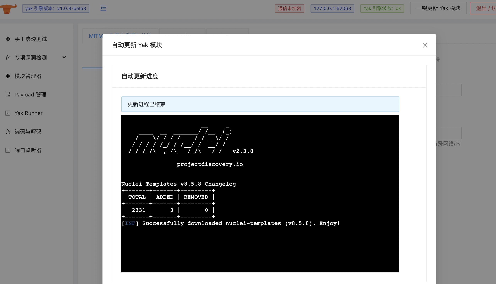

# Yakit: 集成化单兵安全能力平台

Yakit 是 Yak 的衍生项目，Yak 语言核心提供了非常强大的安全能力，但是限于使用形式，用户必须学习 Yak 语言并同时具备对安全的一定理解。

为了让 Yak 本身的安全能力更容易贴近大家的实际使用，我们在为 Yak 编写了 gRPC 服务器， 并使用这个服务器实现 / 构建了一个客户端：Yakit。

Yakit 是一个高度集成化的 Yak 语言安全能力的输出平台，使用 Yakit，我们可以做到：

1. 类 Burpsuite 的 MITM 劫持操作台
1. 查看所有劫持到的请求的历史记录以及分析请求的参数
1. 全球第一个可视化的 Web 模糊测试工具：Web Fuzzer
1. Yak Cloud IDE：内置智能提示的 Yak 语言云 IDE
1. ShellReceiver：开启 TCP 服务器接收反弹交互式 Shell 的反连
1. 第三方 Yak 模块商店：社区主导的第三方 Yak 模块插件，你想要的应有尽有
1. ...

[点此进入下载页](/products/download)

## 第一无二的 Yakit 架构

正如我们在上面提到的，Yakit 的核心并不在工具本身上，而是依托于 Yak gRPC 接口； 也就是说，我们可以仅仅只把 Yakit 当作一个 "视窗" 来操纵 Yak 引擎来完成我们想要实现的安全能力。

我们可以用一张图来简单解释一下 Yakit 的架构是怎么样与传统安全工具有所区别的：


### 依赖说明

:::tip Yakit 的能力需要 Yak 引擎

Yakit 所有的能力都建立在 Yak 引擎提供对应版本的 gRPC 接口支持的基础上。

所以，Yak 引擎启动之后，Yakit 才能连接执行各种各样的安全能力。

:::

#### Yak 模块与专项漏洞检测

专项漏洞检测 PoC 使用 nuclei 生态下的 yaml templates，
但是由于 Yakit 接管了 nuclei 的 templates 的管理，可以为 nuclei 模块生成 Yak 模块的执行过程。

所以用户一般在 Yakit(>=1.0.8-beta3 版本) 的右上角点击 "一键更新"

操作步骤如下：


点击之后，我们将会看到 PoC 更新的整个流程，更新成功后，结果如下



:::danger 没有更新成功？

一般情况下，没有更新成功可能的原因有两个

1. 网络状况
2. Yakit 本地资源目录权限/Owner 配置不合理

如果是第二个原因，可以参考下一节的相关解释来进行操作。

:::


### 用户数据与本地文件存储

一般来说，本地文件与用户存储数据将会存储在 `$HOME/yakit-projects/` 目录下。

目录中的文件包括
1. MITM 需要用到的根证书与根证书的密钥
2. sqlite3 格式的数据库，数据库的内容是 Yakit 使用的记录，包括劫持到的请求，PoC等

:::note 权限说明

用户需要保持这个本地用户文件的目录权限为 `0755`，并且与日常使用用户在同一个组或者同一个用户下

如果权限配置不合理，将会导致 yak grpc 引擎无法正常启动，Yakit 功能失效。

:::

如果本地数据库权限配置不合理，将会导致无法写入数据等问题造成 Yakit 功能不可用。

可以通过如下方式修复

:::tip macOS 下调整资源目录的 owner

```
sudo chown -R user ~/yakit-projects
```
:::

:::tip macOS 下调整资源目录的读写权限

```
sudo chmod 0755 ~/yakit-projects
```
:::

## Happy Hunting!

当我们更新完 PoC 重启之后，点击 "专项漏洞检测"，任意打开一个专项漏洞可以看到如下内容


则可以说明 Yakit 的模块与正常功能，我们都已经加载完毕了，大家可以愉快的使用了！